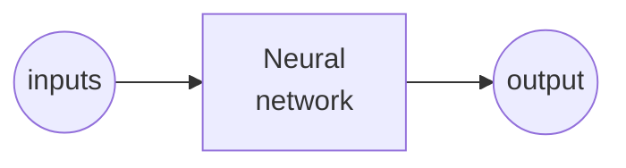

# Chapter 1 - Introduction to ML

A neural network is a computational model that mimics the structure and function of biological neurons. A neuron is a basic unit of a neural network that can receive, process and transmit information. In this chapter, we will explain how neurons work and how they are connected in a neural network.

<!-- A neuron consists of three main components: an input layer, an activation function and an output layer. The input layer receives signals from other neurons or external sources, such as images texts, or numbers. The activation function determines whether the neuron should fire or not based on the input signals. The output layer sends the firing signal to other neurons or to the final output of the network.

The activation function can be a simple threshold function that fires if the input signals exceed a certain value, or a more complex function that can capture nonlinear relationships between inputs and outputs. Some common activation functions are sigmoid, tanh, ReLU and softmax, which will be covered in later chapters.

A neural network is composed of many neurons arranged in layers. The first layer is called the input layer, which receives the raw data. The last layer is called the output layer, which produces the final output of the network. The layers between the input and output layers are called hidden layers, which perform intermediate computations and transformations. The number and size of hidden layers determine the complexity and capacity of the network.

The connections between neurons are called weights, which represent how strongly one neuron influences another. The weights are learned during the training process of the network, where the network adjusts its weights to minimize the error between its output and the desired output. The learning process can be supervised, where the network is given labeled data and feedback, or unsupervised, where the network learns from unlabeled data and self-organization. -->