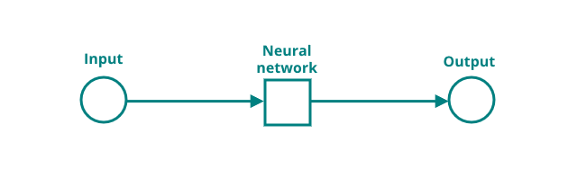

# Chapter 1 - Introduction to Machine Learning

A neural network is a computational model that mimics the structure and function of biological neurons. A neuron is a basic unit of a neural network that can receive, process and transmit information. In this chapter, neuron functions and connections will be explained. After the explanation, a simple project will be programmed to show how a neuron functions mathematically.

---

In the next section, the basics of neurons are introduced.