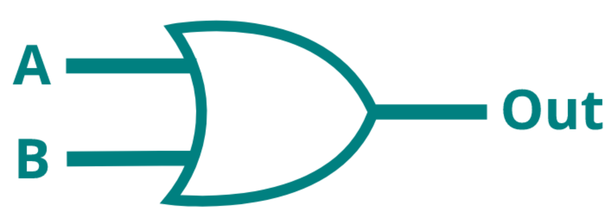

# Logic gates

A logic gate (in electronics), is a device which performs logical operations using binary logic. Logic gates are the fundaments of modern processors, enabling chips to store data using Latches[^1], perform binary calculations using Arithmic Logic Units[^2] and much more.

[^1]: <https://en.wikipedia.org/wiki/Flip-flop_(electronics)>
[^2]: <https://en.wikipedia.org/wiki/Arithmetic_logic_unit>

In this first Mini-project, a single-neuron 'network' will be built to replicate the behaviour of an OR logic gate[^3]. The OR gate will activate whenever either of it's inputs reads HIGH (or 1 in our case).



[^3]: <https://en.wikipedia.org/wiki/OR_gate>

The logic table for an OR gate looks like this:

**Input**||** Output**
:-----:|:-----:|:-----:
0|0|0
0|1|1
1|0|1
1|1|1

---

In order to make writing the equations a bit easier, the sum and activation function are combined into one formula.

$$
\text{output}=f(\sum\text{inputs}*\text{weights})
$$

Now try if the neuron from the [previous section](neuron.md) will predict the correct output for the OR logic gate.

$$
\displaylines{
\text{input 1}=0\\
\text{input 2}=0\\
\text{weight 1}=0.3\\
\text{weight 2}=0.9\\
}
$$

$$
\text{output}=f(0*0.3+0*0.9)=0
$$

That looks promising, so the other inputs are tried as well.

$$
\displaylines{
\text{output}=f(0*0.3+1*0.9)=1 \\
\text{output}=f(1*0.3+0*0.9)=0 \\
\text{output}=f(1*0.3+1*0.9)=1 \\
}
$$

Almost correct, however with the inputs $1,0$, the neuron wrongly outputs $0$, which should be $1$ (according to the logic table above).

How can this behaviour be changed? <br> Change the weights!

Take a closer look at the calculation of the incorrect output.

$$
\text{sum}=\text{input 1}*\text{weight 1}+\text{input 2}+\text{weight 2}\\
=1*0.3+0*0.9=0.3
$$

Indeed, if the sum is run through the activation function, the result is incorrect.

$$
f(0.3)=0
$$

The output of the sum, $0.3$, is too low to trigger the activation function. By intuitively approaching the calculations above, there are some things that can be concluded:

- the inputs cannot be changed
- the activation function could be changed
- the weights could be changed

In neural networks, inputs cannot change, so it does not make sense to focus on that aspect of the calculation. The activation function could be changed, however since the activation function produced correct outputs for the other inputs, this is probably not the issue (additionally, activation functions in neural networks are only rarely changed to get to the desired output). Lastly, the weights can be changed, and consequently, this is the usual way of tuning a neural network to achieve correct outputs.

In order to trigger the activation function $f(x)$, the sum for inputs $1,0$ needs to be higher than or equal to 0.5. If the $\text{weight 1}$ is increased to $0.5$ for example, recalculate all outputs and see if the neuron 'network' is correct for all inputs.

$$
\displaylines{
\text{output}=f(0*0.5+0*0.9)=0 \\
\text{output}=f(0*0.5+1*0.9)=1 \\
\text{output}=f(1*0.5+0*0.9)=1 \\
\text{output}=f(1*0.5+1*0.9)=1 \\
}
$$

Alternatively, to see the changes $\text{weight 1}$ has on the outputs of the model, use the interactive visualisation below.

<script src="https://cdnjs.cloudflare.com/ajax/libs/p5.js/1.6.0/p5.js"></script>
<script>
let img;

function preload() {
    img = loadImage('https://j-siderius.github.io/TinySpark/assets/images/inputs_neuron_structure.png')
}

let slider1;
let weights = [
  0.3,
  0.9
];

function setup() {
  const canvas = createCanvas(600, 400);
  canvas.parent('sketch-holder');

  slider1 = select('#weight1')
}

function draw() {
  background(220);

  image(img, 0, 0)
  
  weights[0] = slider1.value();
  
  fill(0, 102, 153);
  textSize(18);
  text(' = '+ weights[0], 218, 112);
  text(' = '+ weights[1], 226, 263);
  
  let outputs = [
    (0*weights[0]+0*weights[1])>=0.5 ? 1 : 0,
    (0*weights[0]+1*weights[1])>=0.5 ? 1 : 0,
    (1*weights[0]+0*weights[1])>=0.5 ? 1 : 0,
    (1*weights[0]+1*weights[1])>=0.5 ? 1 : 0
  ];
    
  text('Outputs:', 350, 140)
  text('[0,0] = ' + outputs[0], 350, 160);
  text('[0,1] = ' + outputs[1], 350, 180);
  text('[1,0] = ' + outputs[2], 350, 200);
  text('[1,1] = ' + outputs[3], 350, 220);
}
</script>
<div>
    <div id="sketch-holder"></div>
    <label for="weight1">Weight 1</label>
    <input type="range" id="weight1" name="weight1" min="0" max="1" value="0.3" step="0.1">
</div>

Now that the weights are tuned correctly, program this neuron 'netowkr' into a simple Python script. To make sure that all possible inputs of the OR-gate are covered, they are stored inside of an array. The array will be looped over, and outputs for every input combination will be created.

[](https://colab.research.google.com/drive/1ifiq6e0aOzHRPsRP8OT0_t_h8MajBrlx#scrollTo=DykfGQVnQ2k5)

```python title="single_neuron_OR_gate.py"
inputs = [
    [0, 0],
    [0, 1],
    [1, 0],
    [1, 1]
]
weight1 = 0.5
weight2 = 0.9

for input in inputs:
    sum = (input[0] * weight1) + (input[1] * weight2)
    if sum >= 0.5:
        activation = 1
    else:
        activation = 0
    
    print(input, activation)

=> [0, 0]   0
=> [0, 1]   1
=> [1, 0]   1
=> [1, 1]   1
```

---

In the next section, we will deploy this network to our TinySpark development board, in order to experience how to expand our neuron 'network' beyond the screen.