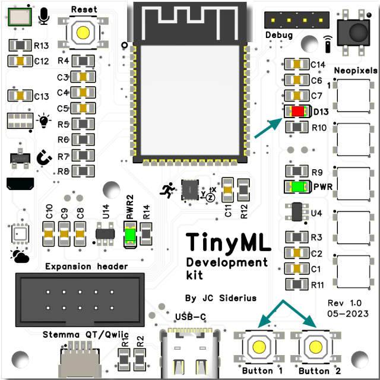

# Logic gates on the TinySpark development board

Now that the first neuron 'network' was succesfully implemented, it will be transported to the TinySpark development kit.

The two buttons, `Button 1` and `Button 2` on the development kit will be used to simulate the inputs, and thee LED (`LED13`) will be used to show if the output of the neuron 'network' is LOW/0 or HIGH/1. In order to access the Inputs and Outputs of the development kit, some code is needed. The code below combines the example code for interaction with the [buttons](https://github.com/j-siderius/TinySpark/blob/main/docs/assets/examples/buttons.py) and output through the [LED](https://github.com/j-siderius/TinySpark/blob/main/docs/assets/examples/led.py).

[](https://github.com/j-siderius/TinySpark/blob/main/docs/assets/examples/input_output.py)

```python title="input_output.py"
# import the library to take care of the pins
import board
from digitalio import DigitalInOut, Direction

# initialise the pins
button1 = DigitalInOut(board.BUTTON1)
button1.direction = Direction.INPUT
button1.pull = pull.UP
button2 = DigitalInOut(board.BUTTON2)
button2.direction = Direction.INPUT
button2.pull = pull.UP
led = DigitalInOut(board.LED)
led.direction = Direction.OUTPUT

# turn the LED on
led.value = True

# loop endlessly
while 1:
    # check if a button is pressed, and print if it is (buttons are pulled HIGH, so check for low)
    if not button1.value:
        print("button1 pressed")
    if not button2.value:
        print("button2 pressed")
```



Now the logic from the [previous section](../chapter1/logic_gates.md) needs to be implemented, in order to complete the neuron 'network' and succesfully deploy it to the TinySpark development board.

[](https://github.com/j-siderius/TinySpark/blob/main/docs/assets/examples/OR_gate.py)

```python title="OR_gate.py"
# import the library to take care of the pins
import board
from digitalio import DigitalInOut, Direction

# initialise the pins
button1 = DigitalInOut(board.BUTTON1)
button1.direction = Direction.INPUT
button1.pull = pull.UP
button2 = DigitalInOut(board.BUTTON2)
button2.direction = Direction.INPUT
button2.pull = pull.UP
led = DigitalInOut(board.LED)
led.direction = Direction.OUTPUT

# store the weights
weight1 = 0.5
weight2 = 0.9

# loop endlessly
while 1:
    # Read the button value (buttons are pulled HIGH, so check for low)
    input1 = button1.value
    input2 = button2.value

    sum = (input1 * weight1) + (input2 * weight2)
    if sum >= 0.5:
        # activation = 1
        led.value = True
    else:
        # activation = 0
        led.value = False
```

Upload the code and see if the neuron 'network' functions as expected, by pressing `Button 1` and `Button 2` and observing the LED.

---

In the next chapter, some more complicated predictions will be made by utilising an actual network of neurons.