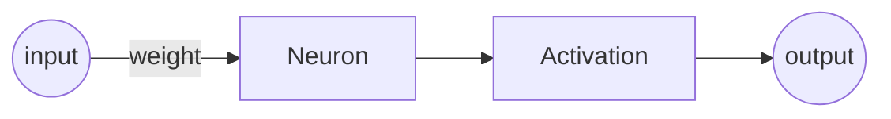
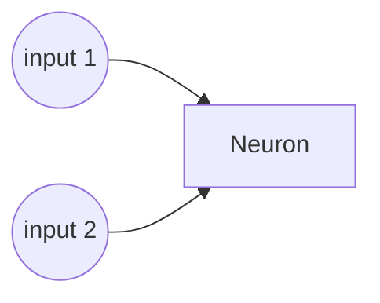

# Chapter 1 - The Neuron

The neuron is at the heart of every neural network, it provides all computation and links to other neurons and layers within the neural network. A neuron consists of three main components: an input layer, an activation function and an output layer. The input layer receives signals from other neurons or external sources, such as images, texts, or numbers. The activation function determines whether the neuron should fire or not based on the input signals. The output layer sends the firing signal to other neurons or to the final output of the network.

The inputs of a neuron come in many different shapes and sizes (literally). A neuron could receive just one single input, or be connected to more than 500 different inputs. The inputs to a neuron are always numeric (since we are essentially working with one giant mathematical formula), so complex inputs like sound or images have to be split into many different parts (e.g. milliseconds of sound or pixels in an image). These can then be fed into the input of a network.

The activation function which comes after the inputs can be a simple threshold function that fires if the input signals exceed a certain value, or a more complex function that can capture nonlinear relationships between inputs and outputs. Some common activation functions are sigmoid, tanh, ReLU and softmax, which will be covered in later chapters.

Let's now look at an example neuron, and how inputs travel through it; suppose we have a neuron with two inputs and a simple threshold function. We will compute the output of this neuron.

The first step in computation of the output is to sum the inputs together:

$$
\sum \text{inputs} = \text{input 1} + \text{input 2} 
$$

Next, the neuron needs to be _activated_ by running the sum through the chosen activation function. We choose a simple threshold function:

$$ 
f(x) =
\begin{cases} 
      0 & \text{if } x < 0.5\\
     1 & \text{if } x \geq  0.5
\end{cases}
$$

