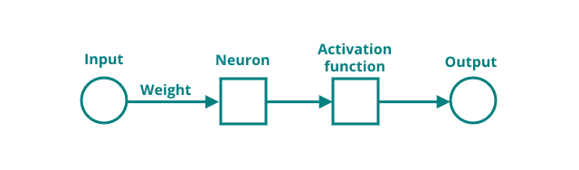
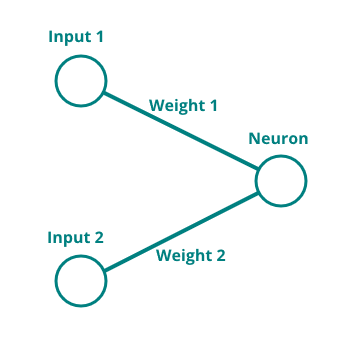

# The Neuron

The neuron is at the heart of every neural network, it provides all computation and links to other neurons and layers within the neural network. A neuron consists of three main components: an input layer, an activation function and an output layer. The input layer receives signals from other neurons or external sources, such as images, texts, or numbers. The activation function determines whether the neuron should fire or not, based on the input signals. The output layer sends the firing signal to other neurons or to the final output of the network.



The inputs of a neuron come in many different shapes and sizes (literally). A neuron could receive just one single input, or be connected to more than 500 different inputs. The inputs to a neuron are always numeric (since this is essentially one giant mathematical formula), so complex inputs like sound or images have to be split into many different parts (e.g. milliseconds of sound or pixels in an image). These can then be fed into the input of a network.

---

The neuron with two inputs, two weights and a simple threshold activation function below will be examined. How do inputs travel through it and how do they lead to an output?



The first step in computation of the output is to sum the inputs of the neuron together with the weights of the neuron:

$$
\sum \text{inputs}*\text{weights} = \text{input 1} * \text{weight 1} + \text{input 2} * \text{weight 2}
$$

The activation function which comes after the inputs can be a simple threshold function that fires if the input signals exceed a certain value, or a more complex function that can capture nonlinear relationships between inputs and outputs. Some common activation functions are sigmoid, tanh, ReLU and softmax. More information can be found in the [Machine Learning glossary](https://ml-cheatsheet.readthedocs.io/en/latest/activation_functions.html).

Now, the neuron needs to be _activated_ by running the sum through the chosen activation function. In this example, a simple threshold function is chosen. If the sum of the neuron is $0.5$ or higher, the output will be $1$, otherwise the output will be $0$.

$$ 
f(x) =
\begin{cases} 
      0 & \text{if } x < 0.5\\
     1 & \text{if } x \geq  0.5
\end{cases}
$$

Now, the output of the neuron with these inputs and weights is calculated as follows:

$$
\displaylines{
\text{input 1}=0.2\\
\text{input 2}=0.8\\
\text{weight 1}=0.3\\
\text{weight 2}=0.9\\
}
$$

$$
\sum \text{inputs}*\text{weights} = 0.2 * 0.3 + 0.8 * 0.9 = 0.78 \\
$$

$$
\text{output}=f(0.78)=1
$$

The output of tje neuron, with the given inputs would be $1$.

---

If this is now implemented into a simple Python script, it could look like this:

Implementing this simple neuron logic into Python should be straightforward.

[](https://colab.research.google.com/drive/1ifiq6e0aOzHRPsRP8OT0_t_h8MajBrlx#scrollTo=Ktv4RpKJP8mR)

```python title="single_neuron.py"
input1 = 0.2
input2 = 0.8
weight1 = 0.3
weight2 = 0.9

sum = (input1 * weight1) + (input2 * weight2)
if sum >= 0.5:
    activation = 1
else:
    activation = 0

print(activation)
```

In the next section, the neuron that was just created will be used to predict something more meaningful.