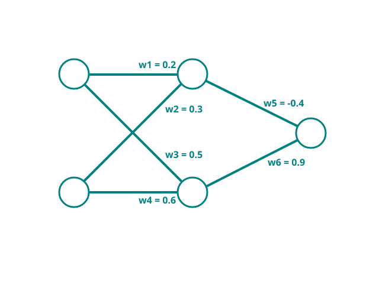

# Advanced logic gates

In the first chapter, Logic gates were introduced. The mini-project programmed a OR gate in Python, and later implemented it onto the TinySpark development board.

There are several more complex logic gates in electronics, such as the XOR gate [^1]. The XOR gate will only activate whenever one of it's inputs reads HIGH (or 1 in our case). The gate will however not activate if both inputs read HIGH (1) or LOW (0).

[^1]:<https://en.wikipedia.org/wiki/XOR_gate>

The logic table for an XOR gate looks like this:

**Input**||** Output**
:-----:|:-----:|:-----:
0|0|0
0|1|1
1|0|1
1|1|0

Classifying inputs to an XOR gate is a little more difficult than classifying simple logic gates. The reason behind this is the case of linear and non-linear separability[^2]. Separability refers to the property of a dataset or set of points (in this case our inputs) where it is possible to draw a straight line that can completely separate the points into different classes (0 or 1 in our case). The XOR logic gate proposed above is such a non-linearly separable problem. To overcome this, it is nescessary to introduce more neurons into the neural network.

[^2]:<https://en.wikipedia.org/wiki/Linear_separability>

---



Weights are defined for our network. For the activation function, the step function from [Chapter 1](../chapter1/logic_gates.md) is used again. Note how in this example, negative weights are also possible, and we introduce it to weight the first input of the output neuron.

$$
\displaylines{
\text{weight 1}=0.2\\
\text{weight 2}=0.3\\
\text{weight 3}=0.5\\
\text{weight 4}=0.6\\
\text{weight 5}=-0.4\\
\text{weight 6}=0.9\\
}
$$

Calculating the outputs for all input combinations is now a little more complicated than in the previous chapter. The first calculation is broken down into it's individual steps, then the rest of the inputs are calculated in one go.

$$
\displaylines{
\text{output(0,0)}=f(f(0*0.2+0*0.3)*-0.4+f(0*0.5+0*0.6)*0.9)=0\\
\text{output(0,1)}=f(f(0*0.2+1*0.3)*-0.4+f(0*0.5+1*0.6)*0.9)=1\\
\text{output(1,0)}=f(f(1*0.2+0*0.3)*-0.4+f(1*0.5+0*0.6)*0.9)=1\\
\text{output(1,1)}=f(f(1*0.2+1*0.3)*-0.4+f(1*0.5+1*0.6)*0.9)=1\\
}
$$

Now the inputs $1,1$ give the incorrect output of $1$, so again the weights need to be tweaked. Compared to the neuron in the last chapter, tweaking becomes more complicated in this network. Breaking down the calculation into small steps to see where the error occurs is a good way to start.

$$
\displaylines{
\text{output_hidden1}=f(1*0.2+1*0.3)=f(0.5)=1\\
\text{output_hidden2}=f(1*0.5+1*0.6)=f(1.1)=1\\
\text{output}=f(1*-0.4+1*0.9)=f(0.5)=1\\
}
$$

To ensure the correct output of $0$, the output neuron calculation for needs to result in a value less than $0.5$ (as our activation-function $f(x)$ steps at $0.5$). If the weight $-0.4$ is tweaked to a value of $-0.5$, the activation function will not output $1$ anymore, since the result of the sum is $(1*-0.4 + 1*0.9)=0.4$.

Now program this into a simple Python script. The weights of the network will be stored inside of an array.

[](https://colab.research.google.com/drive/1n0ICeDesHq-a74yKYkdi2NV9295TgGCH#scrollTo=kK0VsuHfyz7M)

```python title="small_network_XOR_gate.py"
inputs = [
    [0, 0],
    [0, 1],
    [1, 0],
    [1, 1]
]
weights = [
     0.2,
     0.3,
     0.5,
     0.6,
    -0.5,
     0.9
]

def activation(x):
    if x >= 0.5:
        return 1
    else:
        return 0

for input in inputs:
    neuron1 = activation( (input[0] * weights[0]) + (input[1] * weights[1]) )
    neuron2 = activation( (input[0] * weights[2]) + (input[1] * weights[3]) )
    output = activation( (neuron1 * weights[4]) + (neuron2 * weights[5]) )

    print(input, output)

=> [0, 0]   0
=> [0, 1]   1
=> [1, 0]   1
=> [1, 1]   0
```

In the next section, the network will be deployed to the TinySpark development board.