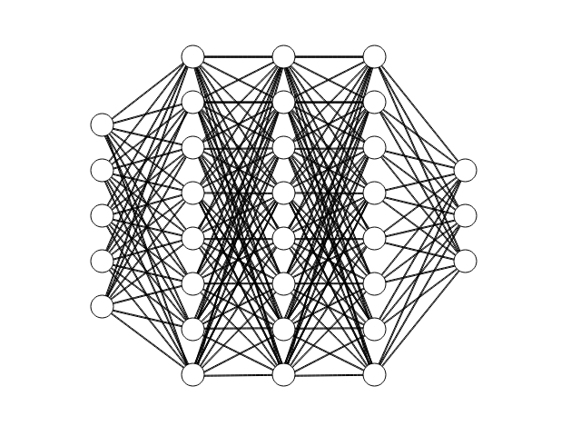

# Chapter 2 - The neuron problem

As shown in the last chapter, a neuron is capable of predicting outcomes based on the inputs and weights it is given. A single neuron can only perform linear or simple non-linear transformations, which may not be sufficient to represent the complexity of real-world problems. To overcome this restriction, a network of neurons can model non-linear relationships better than a single neuron, because it can capture more features and interactions among the inputs.

The network component of a neural network is the structure that defines how the neurons are arranged and connected. A neural network consists of multiple layers of neurons, each layer performing some computation on the inputs from the previous layer and passing the outputs to the next layer. The first layer is called the input layer, and the last layer is called the output layer. The layers in between are called hidden layers. The number and size of the hidden layers determine the complexity and capacity of the neural network. In this chapter, a closer look will be taken at the network that forms prediction models.

