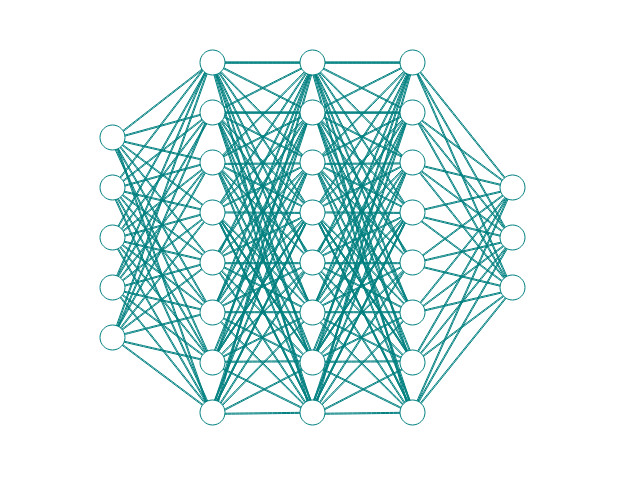

# Chapter 2 - Introduction to networks

The network component of a neural network is the structure that defines how the neurons are arranged and connected. A neural network consists of multiple layers of neurons, each layer performing some computation on the inputs from the previous layer and passing the outputs to the next layer. The first layer is called the input layer, and the last layer is called the output layer. The layers in between are called hidden layers. The number and size of the hidden layers determine the complexity and capacity of the neural network. In this chapter, we will take a closer look at the network that forms prediction models.

