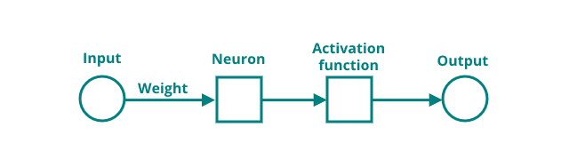
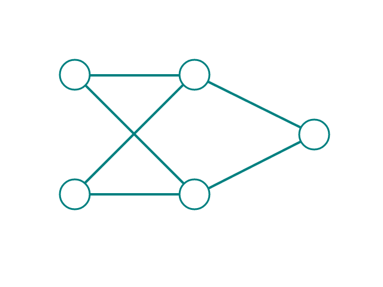

# Network connections

Looking back at a single neuron, which has an input, weight, activation function and output, it is easy to see how one could chain neurons together to form a network.

By connecting the output of a neuron to the input of another neuron, the beginning of a network is formed. Extending this to more neurons, for example, two input neurons, two hidden neurons and one output neuron. If all neurons are interconnected to each other, like in the image below, this is called a Fully-connected Neural Network.

Input neurons or nodes generally have no activation function and weights associated to them, they merely provide a place to store inputs for further computation.

In the next section, the Fully-connected Neural Network in the image above will be implemented in Python.