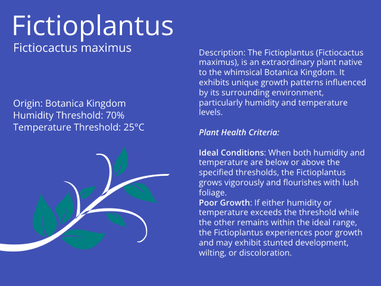

# Advanced plant monitoring

In the first chapter, Logic gates were introduced. The mini-project programmed a OR gate in Python, and later implemented it onto the TinySpark development board.

During this mini-project, plant care is of highest regard. The _Fictioplantus_[^1], as can be read below, is a very delicate plant from the Botanica Kingdom. It requires careful control of both temperature and humidity, as it will grow very poorly when conditions are not right.



The requirements for succesful growth are very particular, they are summarized in the table below.

**Temperature**|**Humidity**|**Growth**
:-----:|:-----:|:-----:
below 25&deg;|below 70%|no
below 25&deg;|above 70%|yes
above 25&deg;|below 70%|yes
above 25&deg;|above 70%|no

[^1]:The Fictioplantus acts as a simplified plant example in our case, although principles learned in this project can be applied to real plant monitoring.

Classifying inputs like the temperature and humidity is a little more difficult than classifying simple logic gates. The reason behind this is the case of linear and non-linear separability[^2]. Separability refers to the property of a dataset or set of points (in this case our inputs) where it is possible to draw a straight line that can completely separate the points into different classes (below/above 25&deg; or below/above 70% humidity in our case). The problem proposed above is such a non-linearly separable problem. To overcome this, it is nescessary to introduce more neurons into the neural network.

[^2]:<https://en.wikipedia.org/wiki/Linear_separability>

---


**TODO: Fix image weights**

The network from the [previous section](network_connections.md) is used here. Weights are defined as seen. For the activation function, the step function from [Chapter 1](../chapter1/logic_gates.md) is used again. Note how in this example, negative weights are also possible, and we introduce it to weight the first input of the output neuron.

$$ 
f(x) =
\begin{cases} 
      0 & \text{if } x < 0.5\\
     1 & \text{if } x \geq  0.5
\end{cases}
$$

<!-- $$
\displaylines{
\text{weight 1}=0.2\\
\text{weight 2}=0.3\\
\text{weight 3}=0.5\\
\text{weight 4}=0.6\\
\text{weight 5}=-0.4\\
\text{weight 6}=0.9\\
}
$$ -->

$$
\displaylines{
\text{weight 1}=0.3\\
\text{weight 2}=-0.5\\
\text{weight 3}=-0.6\\
\text{weight 4}=0.4\\
\text{weight 5}=0.7\\
\text{weight 6}=0.5\\
}
$$

In order to process the inputs correctly, some pre-proccessing of the measurements needs to take place. The temperature and humidity will both be set around null and their inputs divided by 10: $temp_{in} = (temperature - 24) / 10$ and $humid_{in} = (humidity - 70) / 10$. This is done in order to make calculations easier, and to keep weights managable (in this case within ranges -1 and 1). In complicated neural networks, this pre-processing can be part of the network, in so called Convolutional layers[^3].

[^3]:https://en.wikipedia.org/wiki/Layer_(deep_learning)

Calculating the outputs for some possible input combinations is now a little more complicated than in the previous chapter.

<!-- $$
\displaylines{
\text{output(0,0)}=f(f(0*0.2+0*0.3)*-0.4+f(0*0.5+0*0.6)*0.9)=0\\
\text{output(0,1)}=f(f(0*0.2+1*0.3)*-0.4+f(0*0.5+1*0.6)*0.9)=1\\
\text{output(1,0)}=f(f(1*0.2+0*0.3)*-0.4+f(1*0.5+0*0.6)*0.9)=1\\
\text{output(1,1)}=f(f(1*0.2+1*0.3)*-0.4+f(1*0.5+1*0.6)*0.9)=1\\
}
$$ -->

<!-- $$
\displaylines{
\text{output(0,0)}=f(f(0*0.2+0*0.3)*-0.4+f(0*0.5+0*0.6)*0.9)=0\\
\text{output(0,1)}=f(f(0*0.2+1*0.3)*-0.4+f(0*0.5+1*0.6)*0.9)=1\\
\text{output(1,0)}=f(f(1*0.2+0*0.3)*-0.4+f(1*0.5+0*0.6)*0.9)=1\\
\text{output(1,1)}=f(f(1*0.2+1*0.3)*-0.4+f(1*0.5+1*0.6)*0.9)=1\\
}
$$ -->

<!-- Now the inputs $1,1$ give the incorrect output of $1$, so again the weights need to be tweaked. Compared to the neuron in the last chapter, tweaking becomes more complicated in this network. Breaking down the calculation into small steps to see where the error occurs is a good way to start. -->

<!-- $$
\displaylines{
\text{output_hidden1}=f(1*0.2+1*0.3)=f(0.5)=1\\
\text{output_hidden2}=f(1*0.5+1*0.6)=f(1.1)=1\\
\text{output}=f(1*-0.4+1*0.9)=f(0.5)=1\\
}
$$ -->

<!-- To ensure the correct output of $0$, the output neuron calculation for needs to result in a value less than $0.5$ (as our activation-function $f(x)$ steps at $0.5$). If the weight $-0.4$ is tweaked to a value of $-0.5$, the activation function will not output $1$ anymore, since the result of the sum is $(1*-0.4 + 1*0.9)=0.4$. -->

Now program this into a simple Python script. The weights of the network will be stored inside of an array. The inputs for temperature and humidity can be either input manually, or fetched from an external API that supplies weather data, such as the [Buienradar API](https://www.buienradar.nl/overbuienradar/gratis-weerdata).

[](https://colab.research.google.com/drive/1n0ICeDesHq-a74yKYkdi2NV9295TgGCH#scrollTo=kK0VsuHfyz7M)

```python title="small_network_XOR_gate.py"
inputs = [
    [0, 0],
    [0, 1],
    [1, 0],
    [1, 1]
]
weights = [
     0.2,
     0.3,
     0.5,
     0.6,
    -0.5,
     0.9
]

def activation(x):
    if x >= 0.5:
        return 1
    else:
        return 0

for input in inputs:
    neuron1 = activation( (input[0] * weights[0]) + (input[1] * weights[1]) )
    neuron2 = activation( (input[0] * weights[2]) + (input[1] * weights[3]) )
    output = activation( (neuron1 * weights[4]) + (neuron2 * weights[5]) )

    print(input, output)

=> [0, 0]   0
=> [0, 1]   1
=> [1, 0]   1
=> [1, 1]   0
```

In the next section, the network will be deployed to the TinySpark development board, utilising the on-board sensors.