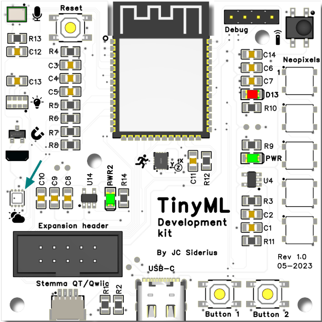

# Plant monitoring on the TinySpark development board

Now that you have implemented your first real neural network, let's deploy it to the TinySpark development kit.

The environmental sensor (more information on the [TinyML development kit sensors page](../kit/devkit.md)) will be used for the temperature and humidity measurements. In a deployment, this sensor could be mounted close to the plant, and be configured to send a message to the gardener, or remotely open a window or start a ventilator. For now, the result of the prediction will be printed to the Serial monitor (see the [Programming guide](../kit/programming.md) for more information).



Let's implement the logic from our last section, and build the neural network into the development board code.

[]()

```python title="devboard_plant_monitoring.py"
# import the libraries to take care of our sensor and manage time
import board
import time
from adafruit_bme280 import basic as adafruit_bme280

# initialise the environmental sensor
i2c = board.I2C()
bme280 = adafruit_bme280.Adafruit_BME280_I2C(i2c)

# store our weights
weights = [
    0.3,
    -0.5,
    -0.6,
    0.4,
    0.7,
    0.5
]

# defining the activation function
def activation(x):
    if x >= 0.5:
        return 1
    else:
        return 0

# loop endlessly
while 1:
    # get the sensor readings and print them
    temperature = bme280.temperature
    humidity = bme280.relative_humidity
    print(f"Temperature: {temperature}, Humidity: {humidity}")

    # pre-processing the inputs
    temp_in = (temperature - 25) / 10
    humid_in = (humidity - 70) / 10

    # perform network calculations
    neuron1 = activation( (temp_in * weights[0]) + (humid_in * weights[1]) )
    neuron2 = activation( (temp_in * weights[2]) + (humid_in * weights[3]) )
    output = activation( (neuron1 * weights[4]) + (neuron2 * weights[5]) )

    # printing the result
    if output == 1:
        print("Growing conditions are good")
    else:
        print("Growing conditions are poor")

    # perform the prediction every 2 seconds to see if it has changed
    time.sleep(2)
```

Let's upload the code and see if the network works on the development board! You can try to manipulate the readings for temperature and humidity by breathing or blowing on the environmental sensor (see where it is on the board in the [TinyML kit introduction](../kit/devkit.md)). To cool the sensor down again or to get the humidity lower, let some ambient air go over the sensor, for example by holding it in the wind or by putting a fan over it.