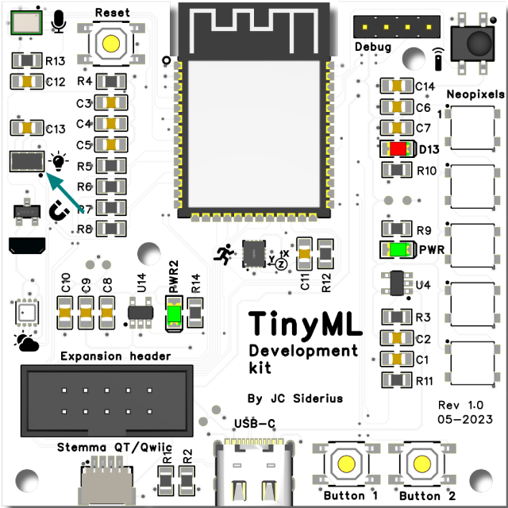
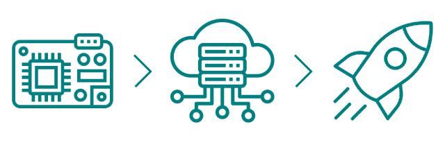

# Gesture recognition - data aquisition

In this mini-project, a simple gesture recognition system will be built. Using the on-board proximity sensor introduced in the [TinySpark development section](../kit/devkit.md), two states will be detected: 

- moving closer
- moving away



To detect these gestures, a network that takes in multiple proximity readings needs to be devised. In this example, three measurements will be input into the network: one measurement that is current, one that was 250ms ago, and one that is 500ms ago. This _Time series_[^1] prediction method is a common way to analyse real-time sensor data using a neural network.

[^1]:<https://en.wikipedia.org/wiki/Time_series>

In order to train an accurate neural network, it is important to record actual data on the end device. In more complex systems however, it is not feasible to train the neural network on the data recording device, as it would take far too long to perform all training calculations there. Therefore, it is common practise to capture measurements on the local device, transfer them to a more powerful computer (e.g. PC or even to the cloud) and perform the training there. Afterwards, only the tuned weights and the feedforward part of the neural network are transfered back to the local device in order to make predictions.



To start the mini-project, some data needs to be recorded on the TinySpark development kit. The code below will start the recording of the datapoints one second after `Button 1` is pressed. The LED will show when a recording is made. After the recording has finished, the values will be stored in an array. Once `Button 2` is pressed, all datapoints are printed onto the serial console. For information on using the serial console, please read the [TinySpark Programming section](../kit/programming.md). From there, it is possible to copy the measurements over to a training program, which will be discussed further along this section.

[](https://github.com/j-siderius/TinySpark/blob/main/docs/assets/examples/gesture_data_recording.py)

```python title="gesture_data_recording.py"
# Import all libraries
import time
import board
from apds9930.apds9930 import APDS9930
from digitalio import DigitalInOut, Direction, Pull

# Initialize I2C
i2c = board.I2C()
sensor = APDS9930(i2c)

# Initialise buttons 1 and 2
button1 = DigitalInOut(board.BUTTON1)
button1.direction = Direction.INPUT
button1.pull = Pull.UP
button2 = DigitalInOut(board.BUTTON2)
button2.direction = Direction.INPUT
button2.pull = Pull.UP

# Initialise LED
led = DigitalInOut(board.LED)
led.direction = Direction.OUTPUT

# Array for storing the measurements
proximity_readings = list()

# Loop continuously
while True:

    # Check button 1 (note the signal is pulled up / high, so check for low signal)
    if button1.value == 0:

        # Startup delay
        recording = list()
        print("> Starting recording in 1sec")
        time.sleep(1)

        # Start recording
        led.value = 1
        distance = sensor.proximity
        recording.append(distance)
        print(f"{distance=}")
        # delay for 250ms
        time.sleep(0.250)
        distance = sensor.proximity
        recording.append(distance)
        print(f"{distance=}")
        # delay for another 250ms
        time.sleep(0.250)
        distance = sensor.proximity
        recording.append(distance)
        print(f"{distance=}")

        # Stop recording
        led.value = 0
        print("> Stopped recording")
        proximity_readings.append(recording)

    # Check button 2
    elif button2.value == 0:

        # Print all recordings to the serial console, in form of an array
        print("Recordings: [-500ms, -250ms, current]")
        print("[")
        for recording in proximity_readings:
            print(f"[{recording[0]}, {recording[1]}, {recording[2]}],")
        print("]")

        # Clear the measurement storage
        proximity_readings = list()
        
        # Pause after resetting
        time.sleep(1)

    # Debounce the buttons
    time.sleep(0.01)
```

To record some datapoints, press `Button 1` and when the LED turns on, then perform a gesture. After recording some datapoints, press `Button 2` to print them to the serial console. It is advisable to record all datapoints for one type of gesture, then print those, then continue to record the next type. Store the measurements somewhere (as they will be used in the next section) and make sure to label them appropriately. _About 5-7 datapoints per gesture are enough for this example._

??? info "Proximity sensor measurements"

    Since the proximity sensor included on the TinySpark development board was originally produced for use in hand-detecting applications such as automatic soap dispensers, the optimal measurement range is between 10-25cm from the sensor. Additionally, it is easiest to use a solid coloured object such as a piece of paper or cardboard to record the gestures, as this ensures accurate detection.

    Use the distance printed to the serial console in order to see if the measurement(s) makes sense. If they don't seem right, try again and delete the old measurement(s) by emptying the array using `Button 2`. Also look at [TinySpark development kit description](../kit/devkit.md) to see the example code for the proximity (and light) sensor.

In the next section, the measurements will be run through the neural network and the weights will be trained using backpropagation.