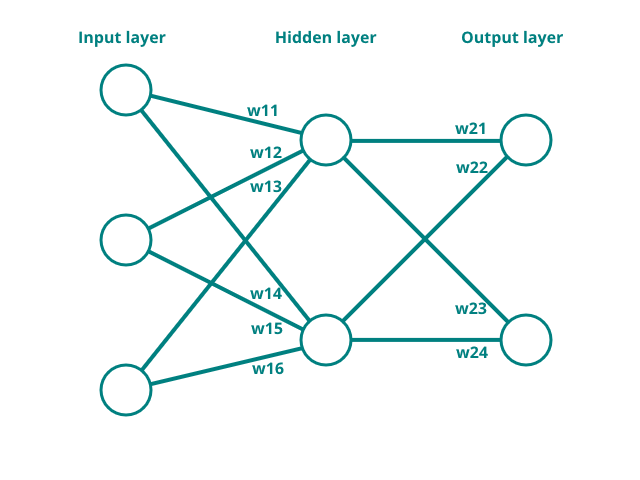

# Gesture recognition - training the model

To continue building the neural network that will recognise gestures, the mathemathics as discussed in a [previous section](../chapter3/training.md) will be implemented in Python. Then the aquired data from the [last section](../chapter3/gesture_recognition_data.md) will be used to train the network. Finally, the tuned weights will be used to run the model on the TinySpark development kit in order to detect gestures.

For this model, a neural network with two hidden neurons and two output neurons is chosen. Since three measurements are taken, three input neurons are required. For the output, two neurons are chosen, as to give the probability of each of the gestures: $\text{output1}=p(\text{moving closer})$ and $\text{output2}=p(\text{moving away})$. The weights are initialised randomly, since it is not possible to determine starting weights by hand in a meaningful way anymore. The randomisation uses a uniform random distribution between $-1$ and $1$. Below, a depiction of the described neural network can be found.



With the measurements take in the [previous section](../chapter3/gesture_recognition_data.md), one example calculation will be performed on a _moving closer_ measurement. All variables that belong together will be grouped into an array for convenience. Additionally, the linear activation function is defined.

$$
\displaylines{
\text{measurement}=[5.1, 46.7, 120.5]\\
\text{expected output}=[1, 0]\\
\text{weights}1=[-0.50, 0.22, -0.91, 0.61, 0.14, -0.48]\\
\text{weights}2=[0.73, 0.29, -0.29, -0.24]\\
f(x)=x\\
}
$$

Since the measurement values are quite large, and it is best to keep the weights in a network within managable ranges (e.g. between $-2$ and $2$), some pre-processing of the data needs to be performed again. For each measurement in the measurements array, the following calculation will be performed

$$
measurement_{in} = \frac{measurement}{100}
$$

$$
\displaylines{
\text{measurement}=[5.1, 46.7, 120.5]\\
\text{measurement}_{in}=[0.051, 0.467, 1.205]\\
}
$$

The hidden layer can now be determined by using the feedforward calculation.

$$
\displaylines{
\text{hidden}1=f(\text{measurement}_{in}1 * \text{weights}11 + \text{measurement}_{in}2 * \text{weights}12 + \text{measurement}_{in}3 * \text{weights}13)\\
\text{hidden}2=f(\text{measurement}_{in}1 * \text{weights}14 + \text{measurement}_{in}2 * \text{weights}15 + \text{measurement}_{in}3 * \text{weights}16)\\
\text{output}1=f(\text{hidden}1 * \text{weights}21 + \text{hidden}2 * \text{weights}22)\\
\text{output}2=f(\text{hidden}1 * \text{weights}23 + \text{hidden}2 * \text{weights}24)\\
}
$$

$$
\displaylines{
\text{hidden}1=-1.0193\\
\text{hidden}2=-0.4819\\
\text{output}1=-0.8839\\
\text{output}2=0.4112\\
}
$$

Now the error is calculated. Additionally, since there is more than one output, the _Loss_ is calculated. This serves as a measure of all error in the system (the compound error). There are many different loss functions[^1], but for the sake of simplicity, our loss function will just be a summation of the errors.

[^1]:<https://en.wikipedia.org/wiki/Loss_function>

$$
\displaylines{
    \text{error}1=\text{output}1 - \text{expected output}1 = -0.8839 - 1 = -1.8839\\
    \text{error}2=\text{output}2 - \text{expected output}2 = 0.4112 - 0 = 0.4112\\
    \text{loss}=\text{error}1 + \text{error}2 = -1.4723
}
$$

To now make the model a bit more accurate, backpropagation will be performed. First, the deltas of the output layer weights ($\text{weights}2$) will be calculated. This is again done by going 'backwards' and using the derivatives, as shown in one of the [previous sections](../chapter3/training.md). Recall that the derivative of $f(x)$ was $1$ and the derivative of the $\text{sum}_{weights}$ was the respective input.

$$
\displaylines{
\delta_{weights}21=\text{error}1*f'(x)*\text{sum}'_{weights21}=-1.8893*1*-1.0193=1.9258\\
\delta_{weights}22=\text{error}1*f'(x)*\text{sum}'_{weights22}=-1.8893*1*-0.4819=0.9105\\
\delta_{weights}23=\text{error}2*f'(x)*\text{sum}'_{weights23}=0.4116*1*-1.0193=-0.4195\\
\delta_{weights}24=\text{error}2*f'(x)*\text{sum}'_{weights24}=0.4116*1*-0.4819=-0.1984\\
}
$$

In order to calculate deltas for the weights in the hidden layer, one more step needs to be considered. Since the weights of the hidden layer neurons affect not only the outcome of their own neuron, but also the outcome of neurons further 'downstream' to them (e.g. in this case the output neurons), their total influence needs to be taken into account when calculating the delta. In practise, this means that first, the backpropagation of the weight for $\text{output}1$ needs to be calculated, and then the backpropagation of the weight for $\text{output}2$ is calculated. Subsequently, these values are summed. In larger networks, with more hidden layers, these calculations can become pretty big and almost impossible to write down in formulas. That is why many machine learning libraries (such as Tensorflow[^2]) do all of this math in the background. But now, for our network with a single hidden layer, the formula will be worked out fully.

??? info "Practical thinking about backpropagation"

    If it is conceptually hard to understand how the backpropagation might function in a larger network, it is best to draw (imaginary) lines from the current delta / weight you are trying to calculate to every possible output of the model. These lines now show which backpropagation calculations need to be performed and summed to get the final delta.

[^2]:<https://www.tensorflow.org/>

$$
\displaylines{
\delta_{weights}11=\text{error}1*f'(x)*\text{sum}'_{weights21}*f'(x)*\text{sum}'_{weights11} + \text{error}2*f'(x)*\text{sum}'_{weights23}*f'(x)*\text{sum}'_{weights11}\\
\delta_{weights}12=\text{error}1*f'(x)*\text{sum}'_{weights21}*f'(x)*\text{sum}'_{weights12} + \text{error}2*f'(x)*\text{sum}'_{weights23}*f'(x)*\text{sum}'_{weights12}\\
\delta_{weights}13=\text{error}1*f'(x)*\text{sum}'_{weights21}*f'(x)*\text{sum}'_{weights13} + \text{error}2*f'(x)*\text{sum}'_{weights23}*f'(x)*\text{sum}'_{weights13}\\
\delta_{weights}14=\text{error}1*f'(x)*\text{sum}'_{weights22}*f'(x)*\text{sum}'_{weights14} + \text{error}2*f'(x)*\text{sum}'_{weights24}*f'(x)*\text{sum}'_{weights14}\\
\delta_{weights}15=\text{error}1*f'(x)*\text{sum}'_{weights22}*f'(x)*\text{sum}'_{weights15} + \text{error}2*f'(x)*\text{sum}'_{weights24}*f'(x)*\text{sum}'_{weights15}\\
\delta_{weights}16=\text{error}1*f'(x)*\text{sum}'_{weights22}*f'(x)*\text{sum}'_{weights16} + \text{error}2*f'(x)*\text{sum}'_{weights24}*f'(x)*\text{sum}'_{weights16}\\
}
$$

$$
\displaylines{
\delta_{weights}11=-1.8893*1*-1.0193*1*0.051 + 0.4116*1*-1.0193*1*0.051 = 0.0768\\
\delta_{weights}12=-1.8893*1*-1.0193*1*0.467 + 0.4116*1*-1.0193*1*0.467 = 0.7034\\
\delta_{weights}13=-1.8893*1*-1.0193*1*1.205 + 0.4116*1*-1.0193*1*1.205 = 1.8150\\
\delta_{weights}14=-1.8893*1*-0.4819*1*0.051 + 0.4116*1*-0.4819*1*0.051 = 0.0363\\
\delta_{weights}15=-1.8893*1*-0.4819*1*0.467 + 0.4116*1*-0.4819*1*0.467 = 0.3326\\
\delta_{weights}16=-1.8893*1*-0.4819*1*1.205 + 0.4116*1*-0.4819*1*1.205 = 0.8580\\
}
$$

Now that all deltas are calculated, they need to be applied to the weights. As introduced in a previous section, it is often common to multiply the delta to a _learning rate_, in order to limit the influence of any single measurement (sample) on the model. In this example, a learning rate of 0.01 will be applied. While this may seem small for this single calculation, keep in mind that these training calculations are often performed hundreds or even thousands of times.

$$
\displaylines{
\text{weight11}_{new}=\text{weight11}-(\text{learning rate}*\delta_{weight11})=-0.50-(0.01*0.0768)=-0.5008\\
\text{weight12}_{new}=\text{weight12}-(\text{learning rate}*\delta_{weight12})=0.22-(0.01*0.7034)=0.2130\\
\text{weight12}_{new}=\text{weight13}-(\text{learning rate}*\delta_{weight13})=-0.91-(0.01*1.8150)=-0.9282\\
\text{weight13}_{new}=\text{weight14}-(\text{learning rate}*\delta_{weight14})=0.61-(0.01*0.0363)=0.6096\\
\text{weight14}_{new}=\text{weight15}-(\text{learning rate}*\delta_{weight15})=0.14-(0.01*0.3326)=0.1367\\
\text{weight15}_{new}=\text{weight16}-(\text{learning rate}*\delta_{weight16})=-0.48-(0.01*0.8580)=-0.4886\\
}
$$

$$
\displaylines{
\text{weight21}_{new}=\text{weight21}-(\text{learning rate}*\delta_{weight21})=0.73-(0.01*1.9258)=0.7107\\
\text{weight22}_{new}=\text{weight22}-(\text{learning rate}*\delta_{weight22})=0.29-(0.01*0.9105)=0.2809\\
\text{weight22}_{new}=\text{weight23}-(\text{learning rate}*\delta_{weight23})=-0.29-(0.01*-0.4195)=-0.2858\\
\text{weight23}_{new}=\text{weight24}-(\text{learning rate}*\delta_{weight24})=-0.24-(0.01*-0.1984)=-0.238\\
}
$$

Now that the weights have been tuned (a little bit), check if the prediction error or loss has improved.

$$
\displaylines{
\text{hidden}1=-1.0446\\
\text{hidden}2=-0.4938\\
\text{output}1=-0.8810\\
\text{output}2=0.4161\\
}
$$

$$
\displaylines{
\text{error1}_{new}=\text{output}1 - \text{expected output}1 = -0.8810 - 1 = -1.8810\\
\text{error2}_{new}=\text{output}2 - \text{expected output}2 = 0.4161 - 0 = 0.4161\\
\text{loss}_{new}=\text{error}1 + \text{error}2 = -1.4649
}
$$

The initial error was $-1.4723$ and the new error has reduced to $-1.4649$, meaning that the training was succesful! Now the above steps need to be reproduced many times, and with different measurements, to ensure that the resulting model works for both gestures.

---

After manually working out one measurement training cycle, it may become apparent why it is good to let a computer program handle all the calculations. So, the training of the gesture recognition system will be put into a Python program.

To introduce some variance into the training, the measurements / samples are shuffled for each training cycle. This ensures that the model gets trained evenly and unbiased. The amount of training epochs and the learning rate were chosen after some experimentation. It is interesting to see what changes in the calculation if these are tweaked (when using machine learning libraries, it is also common to tune these parameters until the desired output or loss is achieved). See if the model is able to train successfully on the measurements recorded in the [last section](../chapter3/gesture_recognition_data.md) by adding your own measurements into the code.

[](https://colab.research.google.com/drive/1iXkkWpqd0snpFr8fS0Kxw4A0u2fysBC8#scrollTo=G1Upy1Z1iPvS)

```python title="training_model.py"
# Import the random library to initialise the weights
import random

### Put the recorded measurements here ### 
moving_closer = [
  [0.0, 35.5, 120.1],
  [2.625, 33.375, 127.875],
  [19.0, 56.375, 127.875],
  [47.875, 51.375, 127.875],
  [40.125, 89.375, 127.875]
]

moving_away = [
  [104.54, 2.375, 0.0],
  [127.875, 33.625, 5.4],
  [120.3, 39.125, 0.0],
  [127.875, 103.25, 23.8],
  [127.875, 29.25, 0.0]
]

# Labeling the collected data, outputting the probability of that gesture
# output1 = p(moving closer), output2 = p(moving away)
moving_closer_labeled = [(sample, [1, 0]) for sample in moving_closer]
moving_away_labeled = [(sample, [0, 1]) for sample in moving_away]

# Making one pile of samples from the split samples above
samples = moving_closer_labeled + moving_away_labeled

# Initialise the weights for the network randomly, define the learning rate and epochs (itterations)
weights = [
    [random.uniform(-0.1, 0.1) for _ in range(6)],
    [random.uniform(-0.1, 0.1) for _ in range(4)]
]
learning_rate = 0.01
epochs = 100

# Define the activation function (linear)
def activation(x):
    return x

# Run the training for the configured epochs
for epoch in range(epochs):

    # Shuffle the samples in order to introduces some variance into the training
    random.shuffle(samples)

    # Define a total loss for the whole system
    loss = 0.0

    # Run through all samples
    for sample in samples:

        # Separate the inputs and expected outputs from the sample, pre-processing the inputs
        inputs = [s/100 for s in sample[0]]
        expected = sample[1]

        # Calculate the output of the hidden layer
        hiddens = [
            activation(inputs[0] * weights[0][0] + inputs[1] * weights[0][1] + inputs[2] * weights[0][2]),
            activation(inputs[0] * weights[0][3] + inputs[1] * weights[0][4] + inputs[2] * weights[0][5])
        ]

        # Calculate the output from the output layer
        outputs = [
            activation(hiddens[0] * weights[1][0] + hiddens[1] * weights[1][1]),
            activation(hiddens[0] * weights[1][2] + hiddens[1] * weights[1][3]),
        ]

        # Calculate the errors
        errors = [
            outputs[0] - expected[0],
            outputs[1] - expected[1]
        ]

        # Add the errors to the system loss
        loss += errors[0] + errors[1]

        # Calculate the deltas for each weight
        deltas = [
            [
                errors[0] * 1 * hiddens[0] * 1 * inputs[0] + errors[1] * 1 * hiddens[0] * 1 * inputs[0],
                errors[0] * 1 * hiddens[0] * 1 * inputs[1] + errors[1] * 1 * hiddens[0] * 1 * inputs[1],
                errors[0] * 1 * hiddens[0] * 1 * inputs[2] + errors[1] * 1 * hiddens[0] * 1 * inputs[2],
                errors[0] * 1 * hiddens[1] * 1 * inputs[0] + errors[1] * 1 * hiddens[1] * 1 * inputs[0],
                errors[0] * 1 * hiddens[1] * 1 * inputs[1] + errors[1] * 1 * hiddens[1] * 1 * inputs[1],
                errors[0] * 1 * hiddens[1] * 1 * inputs[2] + errors[1] * 1 * hiddens[1] * 1 * inputs[2],
            ],
            [
                errors[0] * 1 * hiddens[0],
                errors[0] * 1 * hiddens[1],
                errors[1] * 1 * hiddens[0],
                errors[1] * 1 * hiddens[1]
            ]
        ]

        # Apply the calculated deltas to the weights, keeping in mind the learning rate
        for layer in range(len(weights)):
            for weight in range(len(weights[layer])):
                weights[layer][weight] -= learning_rate * deltas[layer][weight]

    # Print the loss every 10 epochs in order to check progress
    if epoch % 10 == 0:
        print(f"{epoch:} {loss=}")

# Print the final loss of the system and the weights
print(f"{loss=}")
print(f"{weights=}")
```

?? info "Training problems"

    Training a neural network can take some insights and even luck. Below are some points of attention to look at when the training does not work like intended.

    1. One or more of the weights of the model have exploded (gone far into the negative or positive), subsequently skewing the whole model. This can be solved by reducing the learning rate, or by limiting the weights.
    2. One or more of the samples used in training are skewed or an outlier. This can lead to the model not being able to reach acceptably tuned weights. This can be solved by excluding edge cases, or by changing the network structure (shape).
    3. The model outputs `NaN` (Not a Number), if the model is not able to output the weights anymore, this usually means that they have exploded (see point 1 above).
    4. The model does not seem to reach an acceptable loss, even after hundreds or thousands of epochs. This could be caused because a network structure (shape) was chosen that does not fit well with the data it tries to predict.

If the loss at the end of training is satisfactory (e.g. it has decreased a lot), the weights seem to be tuned well. Now they can be loaded into a model that runs on the TinySpark development kit, predicting gestures.

---

In the next section, the model will be transferred to the TinySpark development kit, and the trained weights will be loaded, in order to test the trained model.