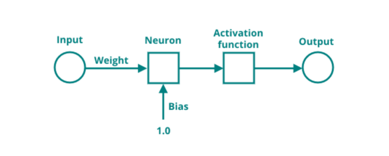

# Training networks

In the last chapters, neuron weights were intuitively tuned to produce precise predictions. The mathematical approach to tuning weights will be explained a little more methodically. 

To start off, a small recap to the calculation of the output of neurons. First, all inputs get summed together with their weights. Then, a activation function is applied to the result and this gives the final output of a neuron. This is commonly known as the _Feedforward_ of neural a network (as in, feeding inputs forward through a neural network, until an output is generated).

In training a neuron, almost the opposite of this process is performed, in the so-called _Backpropagation_[^1]. To start, a input and the expected output is needed. For this example, a single neuron will be used to show all calculations, and in a later section, the mathematics for a simple network will be explained.

[^1]:<https://en.wikipedia.org/wiki/Backpropagation>


The neuron above has the following weights, inputs, expected output and new activation function (this is the linear activation function, chosen for it's simplicity).

$$
\displaylines{
\text{input1}=0.1\\
\text{input2}=0.8\\
\text{expected 1}=0.4\\
\text{weight1}=0.3\\
\text{weight2}=0.9\\
}
$$

$$ 
f(x) = x
$$

The feedfoward of this neuron will look as follows.

$$
\displaylines{
\sum \text{inputs}*\text{weights} = 0.1 * 0.3 + 0.8 * 0.9 = 0.75\\
\text{output}=f(0.75)=0.75\\
}
$$

As can be seen, the predicted result is off by quite a bit. Mathematically speaking, this offset is the error of the prediction. It is calculated as follows.

$$
\displaylines{
\text{error}=\text{output}-\text{expected}\\
\text{error}=0.75-0.4=0.35\\
}
$$

In order to now calculate the required changes to the weights of the network (called the delta / $\delta$), it is nescessary to walk 'backwards' through the network, which in this example only consists of one neuron, and discover the influence of each weight on the final prediction. If the influence is then known, the appropriate changes can be applied to the weights. This technique is called Stochastic Gradient Descent[^2], but for now, just focus on the application.

[^2]:<https://en.wikipedia.org/wiki/Stochastic_gradient_descent>


During the feedforward, two steps were performed:

1. The summation of inputs and weights
2. The activation of the sum

Additionally, one last step is performed at the output of the network, namely the calculation of the error of the prediction.


To calculate backwards, the derivatives of the mentioned steps need to be determined. For step 2, this requires the derivative of the activation function (in this case the linear function).

$$
\displaylines{
f(x)=x\\
f'(x)=1\\
}
$$

For step 1, the derivate of the summation is also easy to calculate.

$$
\displaylines{
\text{sum}=\text{input1}*\text{weight1}+\text{input2}*\text{weight2}\\
\text{sum}'_{weight1}=\text{input1}\\
}
$$

To calculate the total influence, or delta, all values need to be multiplied together. This is shown for both weights below.

$$
\displaylines{
\delta_{weight1}=error*f'(x)*\text{sum}'_{weight1}=0.35*1*0.1=0.035\\
\delta_{weight2}=error*f'(x)*\text{sum}'_{weight2}=0.35*1*0.8=0.28\\
}
$$

Now these deltas can be applied to the weights of the neuron. Note that the delta $\delta$ is being subtracted from the weight, since there is an overshoot of the initial output.

$$
\displaylines{
\text{weight1}_{new}=\text{weight1}-\delta_{weight1}=0.3-0.035=0.265\\
\text{weight2}_{new}=\text{weight2}-\delta_{weight1}=0.9-0.28=0.62\\
}
$$

With these new weights, the output of the neuron has come closer to the expected output. To check if this is indeed the case, the error can be re-calculated as well.

$$
\displaylines{
\sum \text{inputs}*\text{weights}_{new} = 0.1 * 0.265 + 0.8 * 0.62 = 0.5225 \\
\text{output}=f(0.5225)=0.5225\\
\text{error}=0.5225-0.4=0.1225\\
}
$$

Succes! The neuron has now become more accurate at predicting the output. If the above steps are repeated more often, the network will slowly evolve and come closer to an error of $0$. In programming, the repeating training steps are often called _epochs_, with training for a neural network sometimes needing just 100 epochs to get the desired accuracy, or sometimes requiring more than one million epochs.

This training can of course be programmed in Python.

[](https://colab.research.google.com/drive/1iXkkWpqd0snpFr8fS0Kxw4A0u2fysBC8#scrollTo=-HVYddbv6mK_)

```python title="training_example.py"
# Define the inputs, expected output and weights
input1 = 0.1
input2 = 0.8
expected_output = 0.4

weight1 = 0.3
weight2 = 0.9

# Define the (simple) linear activation function
def activation(x):
    return x

# Calculate the output and error of the output
output = activation(input1 * weight1 + input2 * weight2)
error = output - expected_output

print(f"before training: {output=}, {error=}")

# Calculate the deltas for the weights
d_weight1 = 1 * input1 * error
d_weight2 = 1 * input2 * error

# Apply the deltas to the weights
weight1 = weight1 - d_weight1
weight2 = weight2 - d_weight2

# Calculate the output and error of the output again
output = activation(input1 * weight1 + input2 * weight2)
error = output - expected_output

# Print the output and new weights
print(f"after training: {output=}, {error=}")
print(f"new weights: {weight1=},{weight2=}")
```

---

In training bigger neural networks, there are a few more nuances to keep in mind. First, in networks with more possible inputs and expected outputs, it is common to run each input through the training calculation and average all deltas for each respective weight before applying them to that weight. That way, no single input / expected output combination will have too much of an influence on the change in weights. 

$$\delta_{weight}=\frac{\delta_1+\delta_2+...+\delta_n}{n}$$

Next, each neuron in a neural network often has an additional weight applied to its sum called the _bias_[^3]. This bias, which has an input that is a constant $1$, makes sure that the neuron it is attached to can produce a valid output even when all inputs are zeros. The summation function of a neuron is thus slightly changed as seen below.

$$\sum (\text{inputs}*\text{weights}) + \text{bias}$$




[^3]:<https://machine-learning.paperspace.com/wiki/weights-and-biases>

There is often also a _learning rate_[^4] applied to the delta before it changes the weight. This learning rate (common rates include 0.1, 0.05 or 0.01) limits the influence of a single change on the weight. The limiting is important to prevent overshooting the expected output(s) and generating weights that are so tiny or large that they have uncontrolled effects on the network. 

$$\text{weight}_{new}=\text{learning rate}*\delta_{weight}$$

[^4]:<https://en.wikipedia.org/wiki/Learning_rate>

Lastly, it can be beneficial to split input / expected output combinations in subsets, if there exists a lot of training data. This is called _mini-batching_[^5] and  is done to reduce the overall computation- and memory needs to train the network one itteration / epoch. Additionally, it can give the network a faster training cycle as well as quicker approach to the desired accuracy of the model.

[^5]:<https://mzuer.github.io/machine_learning/mini_batch>

In the next section, the training of a neural network is programmed in Python, and an example network is trained using gesture data from the TinySpark development kit.