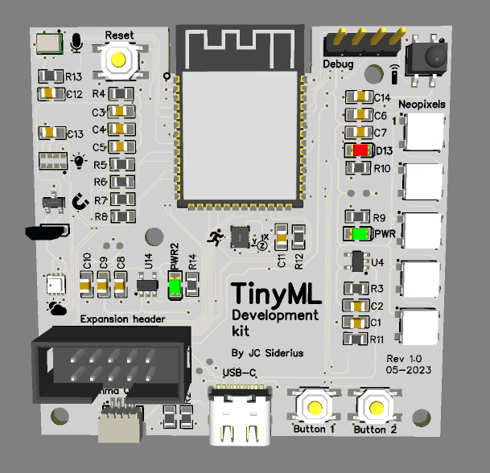

<!--  -->
<!--  -->

# TinySpark

Welcome to **TinySpark**, the online learning platform that teaches you how to create smart machine learning applications on tiny devices. 

Tiny Machine Learning (TinyML) is an emerging field of technology that combines deep learning and embedded systems to enable artificial intelligence on resource-constrained hardware. It has many applications in various domains, such as agriculture, environmental sensing, speech recognition, healthcare, security and more.

On the TinySpark platform, you will interactively learn the basics of neural networks, their structure, mathematics and how to train them. The theoretical learning is alternated with mini-projects that deepen your understanding, leading to fun, engaging and interesting insights into TinyML.

To follow along with the projects and examples, you will need a TinySpark development board, which is a tiny device that packs enough processing power and sensors to start your TinyML journey!

[Get started!](https://j-siderius.github.io/TinySpark/kit/introduction/){ .md-button .md-button--primary}

<!-- [Go to the TinySpark kit Introduction](https://j-siderius.github.io/TinySpark/kit/introduction/){ .md-button .md-button--primary }
[Go to Chapter 1](https://j-siderius.github.io/TinySpark/chapter1/introduction/){ .md-button .md-button--primary }
[Go to About](https://j-siderius.github.io/TinySpark/about/project/){ .md-button .md-button--primary } -->

<!-- Last updated timestamp -->

<i>Last updated: </i>