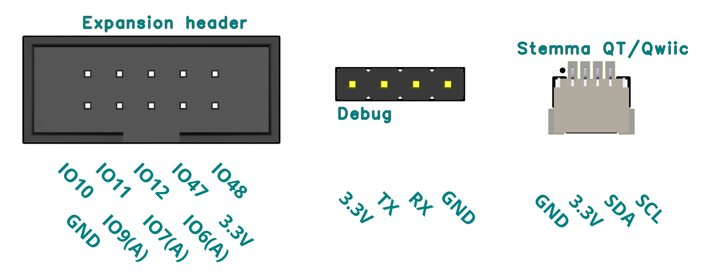

# TinySpark Development kit

The TinySpark Development kit is a development board specifically tailored to exploration of TinyML concepts and test possible applications in an easy manner. It is based on the popular ESP32-S3 chipset, which is perfect for TinyML applications, because of it's fast processor speed and large storage. Additionally it has Bluetooth 5 and WiFi capabilities, making it easy to share sensor data and warn users in case of anomalies. You can learn more about this chip in it's [datasheet](../assets/datasheets/esp32-s3-wroom-1.pdf).

The TinyML Development kit contains a selection of sensors which enable direct deployment for various tasks, as well as expansion options to adapt to your specific projects.

The Development kit contains the following sensors:

- **Inertial motion sensor**: this sensor measures both the angular motion using a gyroscope, as well as the acceleration using a accelerometer. The datasheet for the LSM6DS3TR-C sensor can be found [here](../assets/datasheets/lsm6ds3tr-c.pdf).
- **Microphone**: this sensor measures the amplitude and pitch of sound. The datasheet for the ICS-43434 microphone can be found [here](../assets/datasheets/ics-43434.pdf).
- **Light and Distance sensor**: this sensor measures the ambient light level, as well as short-range distance. The datasheet for the APDS-9930 sensor can be found [here](../assets/datasheets/apds-9930.pdf).
- **Hall effect sensor**: this sensor measures the magnetic field around it's axis. The datasheet for the AH-49E sensor can be found [here](../assets/datasheets/ah-49e.pdf).
- **Environmental sensor**: this sensor measures multiple environmental parameters; temperature, relative humidity as well as atmospheric pressure. The datasheet for the BME-280 sensor can be found [here](../assets/datasheets/bme-280.pdf).
- **Infrared receiver**: this sensor receives infrared signals, for example from a remote control. The datasheet for the IRM-H638T-TR2 receiver can be found [here](../assets/datasheets/irm-h638t-tr2.pdf).

Furthermore, the Development kit contains some other components:

- **USB-C connector**: this connector is used for the main connection to power and program the board. It can be connected using the included USB-C to USB-A cable.
- **Stemma QT / Qwiic connector**: this connector can be used to connect extra sensors to adapt to your specific projects. The connector enables connection to sensors and actuators using the popular [Adafruit Stemma QT](https://www.adafruit.com/category/620) or [Sparkfun Qwiic](https://www.sparkfun.com/categories/399) standards.
- **Expansion header**: this connector can be used to connect extra peripherals, sensors and actuators to adapt to your specific projects. The connector features power, ground, digital and analog connections, giving you the freedom to connect anything you want!
- **Debug header**: this header can be used to debug your code and projects, however the USB-C connector will be mainly used for programming and communication.
- **Buttons**: two buttons are accessible to the user (Button 1 and Button 2), which can be configured for a multitude of uses. The last button (Reset) is used if the board needs to be debugged, or if you want to restart your the board and your application.
- **Output LED**: this Red LED can be used as a simple output, for example to quickly see if your sensor functions correctly. It is connected to the default LED pin, D13.
- **Green LEDs**: these LEDs show if the two power regulators that are on the board function correctly, if the Development baord is powered, they should both be lit.
- **Neopixel LEDs**: the Neopixel LEDs can be used to output application specific information, and since they can be programmed to (individually) display every RGB colour imaginable, you can use them to output loads of useful information. The datasheet for the WS2812B programmable RGB LEDs can be found [here](../assets/datasheets/ws2812b.pdf).
- **Miscellaneous components**: there are two power regulators, as well as some passive components (resistors and capacitors) that ensure stable voltages, configure chips, enable ouputs and regulate power.

There are multiple output pins on the TinyML development board. The specific pinouts are listed in the image below.

In the next section, we will have a look at programming the TinyML Development kit.