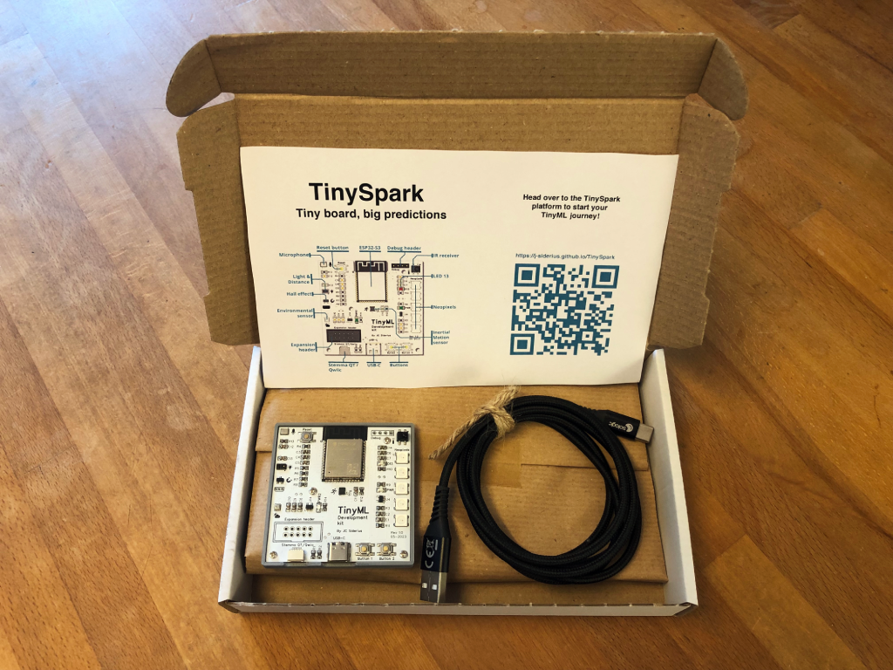

# Introducing TinySpark

These pages give a quick overview of the TinySpark platform and how it works, the TinySpark development kit and all its sensors as well as the programming of neural networks.

<!-- TODO: change picture to include colour insert -->

---

In the next section, the TinySpark platform will be explained. Click on `Next` to continue the _Get Started_ guide.