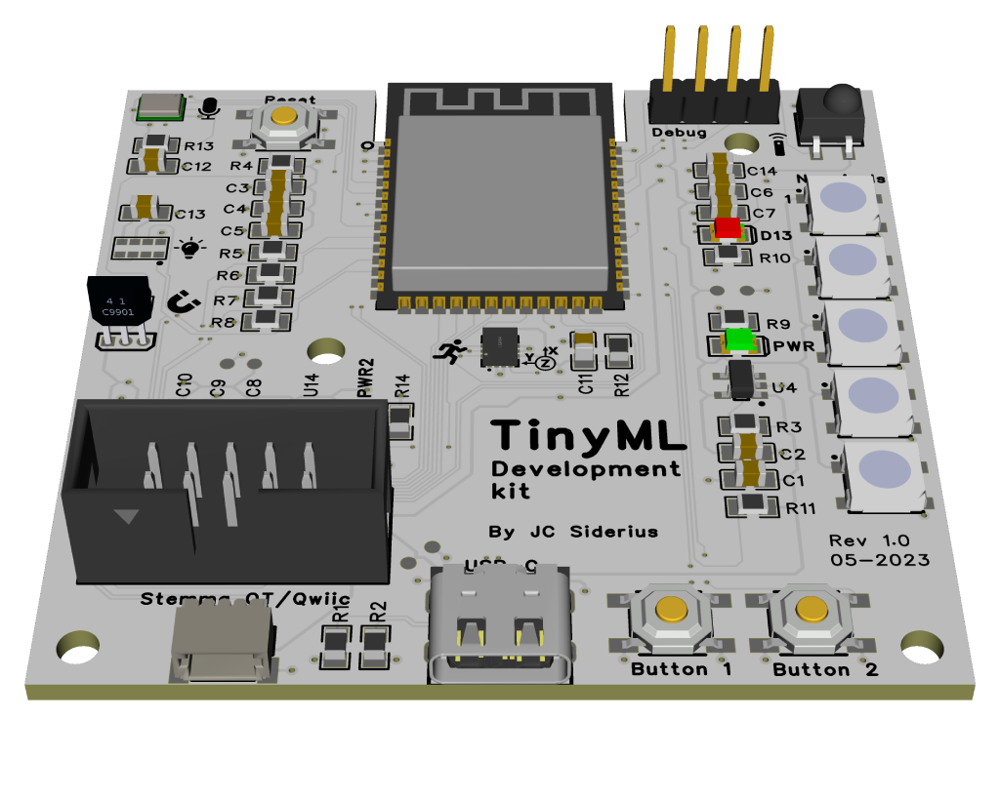

# Introducing the TinySpark kit

These pages give a quick overview of the TinySpark kit.

---

The TinySpark kit contains the following:

- TinySpark platform reference
- TinySpark TinyML development kit
- USB-C cable

In the next section, we will dive into the TinySpark platform.