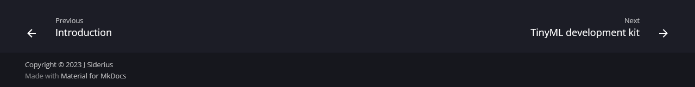

# TinySpark platform

This page gives a quick overview of the the TinySpark platform (this webpage), how it functions, how to use it and where to find help if you need it.

---

The TinySpark platform is divided into several chapters:


- [Getting started (this chapter)](../kit/introduction.md)
- [Chapter 1: Introduction to neurons](../chapter1/introduction.md)
- [Chapter 2: Networks and structures](../chapter2/introduction.md)
- [Chapter 3: Training networks](../chapter3/introduction.md)
- [Beyond TinySpark](../beyond/introduction.md)=

These chapters will introduce various concepts within (Tiny) Machine Learning in an engaging, interactive and project-based way. They can be accessed by clicking on the chapters here, or on the navigation bar at the top of the page (pictured below). Each chapter will explain some theory, let you play around with parts of a neural network and program a mini-project, in which the theory can be put into practise.


To navigate through chapters, it is possible to use the arrows at the bottom of most pages. Clicking the right-arrow will direct you to the next chapter section. The left-arrow can be used to go back to the previous section of a chapter. Additionally, on ccomputers, there is a side-menu available at the top left of each page, which shows all sections of a chapter.



---

The TinySpark platform uses several methods to teach, for example using textual explanation, formulas, code snippets and interactive applications.

Source code will be displayed on the page, with the option to open Python code in [Google Colaboratory], an online code environment for Python notebooks. Any Python code that can be run on a PC (so no TinyML Development Kit code) will be available for testing and playing around on Colab; just click the link and a new notebook will open. If you want to interact with the code, you need a Google account. 

[Google Colaboratory]:https://colab.research.google.com/

[](https://colab.research.google.com/drive/1AoRa8GUn_qJEkL_W6yFm9ECDFSHOD0yD)

```python title="test_code.py"
# This is some Python code
a = 1
b = 2
c = a + b

print(c)
```

TinyML development board code is hosted on Github, since there is no online platform available for running this code. All TinyML code should be uploaded to the development board to see it in action. Further explanation on running code on the TinyML development kit can be found in the [Programming](programming.md) section of this chapter.

[](https://github.com/j-siderius/TinySpark/blob/main/docs/assets/examples/led.py)

```python title="led.py"
# Include all libraries
import time
import board
from digitalio import DigitalInOut, Direction

# Initialise LED, declare it an output
led = DigitalInOut(board.LED)
# led = DigitalInOut(board.D13)  # Alternatively use the well-known pin 13
led.direction = Direction.OUTPUT

# Every second, flash the LED
while True:
    led.value = 0
    time.sleep(1)
    led.value = 1
    time.sleep(1)
```

Concepts can also be explained using interactive applications. These allow you to manipulate values, play around with network structures and more, seeing the effects in real time.

<script src="https://cdnjs.cloudflare.com/ajax/libs/p5.js/1.6.0/p5.js"></script>
<script>
let img;

function preload() {
    img = loadImage('https://j-siderius.github.io/TinySpark/assets/images/inputs_neuron_structure.png')
}

let slider1;
let weights = [
  0.3,
  0.9
];

function setup() {
  const canvas = createCanvas(600, 400);
  canvas.parent('sketch-holder');

  slider1 = select('#weight1')
}

function draw() {
  clear();

  image(img, 0, 0)
  
  weights[0] = slider1.value();
  
  fill(0, 128, 128);
  textSize(18);
  text(' = '+ weights[0], 218, 112);
  text(' = '+ weights[1], 226, 263);
  
  let outputs = [
    (0*weights[0]+0*weights[1])>=0.5 ? 1 : 0,
    (0*weights[0]+1*weights[1])>=0.5 ? 1 : 0,
    (1*weights[0]+0*weights[1])>=0.5 ? 1 : 0,
    (1*weights[0]+1*weights[1])>=0.5 ? 1 : 0
  ];
    
  text('Outputs:', 350, 140)
  text('[0,0] = ' + outputs[0], 350, 160);
  text('[0,1] = ' + outputs[1], 350, 180);
  text('[1,0] = ' + outputs[2], 350, 200);
  text('[1,1] = ' + outputs[3], 350, 220);
}
</script>
<div>
    <div id="sketch-holder"></div>
    <label for="weight1">Weight 1</label>
    <input type="range" id="weight1" name="weight1" min="0" max="1" value="0.3" step="0.1">
</div>

---

In the next section, the TinyML Development Kit will be introduced. Click on `Next` to continue the _Get Started_ guide.