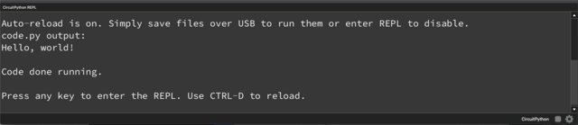

<style> .md-footer__link--next:not([hidden]) { display: none } </style>

# Programming the TinyML Development kit

The TinyML Development kit uses the [CircuitPython] programming language. It is based on the popular Python 3 programming language, and designed to simplify experimentation and learning on microcontrollers and development kits. It requires very little setup on your computer and since the language is based on Python, code is easy to read and understand. Additionally, there are many libraries available, ready to use in your project.

[CircuitPython]:https://learn.adafruit.com/welcome-to-circuitpython/what-is-circuitpython

---

The TinyML development kit is programmed using the included USB-C to USB-A cable. If your computer requires another connection (e.g. USB-C to USB-C) you have to provide your own cable for connecting the kit.

After connecting the TinyML development kit, two green LEDs on the board should light up, indicating that there is power on the board. At the same time, a new USB-drive named `CIRCUITPY` should appear on your computer (in File Explorer, Finder or Files). This drive contains code, software libraries and files. To learn more about the `CIRCUITPY`-drive, take a look at the [Adafruit - Circuitpy Drive guide](https://learn.adafruit.com/welcome-to-circuitpython/the-circuitpy-drive).


---

Programming the TinyML development kit is as easy as editing the `code.py` file that is found on the CIRCUITPY drive. However to make coding for the kit a little easier, the [Code with Mu] IDE will be used. Code with Mu works out of the box with CircuitPython, gives helpful programming prompts and was built with learning in mind.

[Code with Mu]:https://codewith.mu/

To install the software, head to the [Code with Mu - Downloads] page and install the correct version of the IDE for your computer.

[Code with Mu - Downloads]:https://codewith.mu/en/download

??? info "Advanced IDE setup"

    If you are already familiar with programming development kits, or want to work in an IDE which you are familiar with (such as Atom or VS Code), take a look at the [Adafruit - Advanced CircuitPython setup](https://learn.adafruit.com/welcome-to-circuitpython/advanced-setup).

    Be aware that all examples are based on the Code with Mu editor, they should function in other editors as well. Setting up the serial connection to the microcontroller can be somewhat more difficult however.

After installing, open the Code with Mu editor and (upon first start) select the CircuitPython mode. This ensures that the IDE is set up correctly for use with the TinyML development kit.

??? info "Reset the Code with Mu editor"

    If you already started Code with Mu and did not select the CircuitPython mode, click the `Mode` button in the top left of the Code with Mu editor, and select CircuitPython. If you want more information about setting up Code with Mu for CircuitPython, take a look at the [Code with Mu - CircuitPython setup](https://codewith.mu/en/tutorials/1.2/adafruit).


---

Now you can start coding! To begin, try to make the built-in LED (D13) blink.

[](https://github.com/j-siderius/TinySpark/blob/main/docs/assets/examples/led.py)

```python title="led.py"
# Include all libraries
import time
import board
from digitalio import DigitalInOut, Direction

# Initialise LED, declare it an output
led = DigitalInOut(board.LED)
# led = DigitalInOut(board.D13)  # Alternatively use the well-known pin 13
led.direction = Direction.OUTPUT

# Every second, flash the LED
while True:
    led.value  = 0
    time.sleep(1)
    led.value = 1
    time.sleep(1)
```

Copy or write the above code into the Code with Mu editor and click the Save button to save it to the TinyML development board. The red LED should start to blink. Contrary to normal Python, CircuitPython requires the main code file to be named `code.py` and be located in the root of the `CIRCUITPY` drive. You can still work with multiple code files, just make sure that the main file is as described.



If code outputs something (e.g. has a `print("Hello world!")` statement), the serial console can be used. Through the USB connection, it is possible to read out messages from the `print` statements using a serial console. To open the Serial console in Code with Mu, click the Serial button at the top of the window. The serial console will now show at the bottom of the window. For more information, take a look at the [Adafruit CircuitPython - Serial console page](https://learn.adafruit.com/welcome-to-circuitpython/kattni-connecting-to-the-serial-console).

To check out more simple code examples, take a look at the [Adafruit Learning System - Guide to CircuitPython](https://github.com/adafruit/Adafruit_Learning_System_Guides/tree/main/CircuitPython_Essentials) or at the sensor code examples in the [previous section](devkit.md).

---

To access inputs and outputs (I/O) of the TinyML development kit, CircuitPython has defined easy references to the default pins. Certain inputs and outputs can be accessed using their semantic definition (e.g. the output connected to the red LED is `GPIO13`, however it can be referenced  as `board.LED` in the code). All pin definitions can be found in the info box below. To learn more about the board library and pin usage, visit [CircuitPython - Pins and Board](https://learn.adafruit.com/circuitpython-essentials/circuitpython-pins-and-modules).

??? info "Pin definitions"

    The TinyML development kit has the following pin definitions and names:

    Sensors

    ```
    board.GPIO14 board.D14 board.IO14 board.LDO2
    board.GPIO1 board.D1 board.IO1 board.IR board.IR_RECV
    board.GPIO4 board.D4 board.I2S_CLK board.IO4 board.MIC_CLK
    board.GPIO5 board.D5 board.I2S_WS board.IO5 board.MIC_WS
    board.GPIO15 board.D15 board.I2S_DIN board.IO15 board.MIC_DIN
    board.GPIO2 board.D2 board.HALL board.HALL_EFFECT board.IO2
    oard.GPIO21 board.D21 board.IMU board.IMU_INTERRUPT board.IMU_ISR board.IMU_WAKE board.IO21
    ```

    Data busses

    ```
    board.GPIO18 board.D18 board.I2C1_SCL board.I2C_SCL board.IO18 board.SCL
    board.GPIO8 board.D8 board.I2C1_SDA board.I2C_SDA board.IO8 board.SDA
    board.GPIO16 board.D16 board.I2C2_SCL board.I2C_SCL2 board.IO16 board.SCL2
    board.GPIO17 board.D17 board.I2C2_SDA board.I2C_SDA2 board.IO17 board.SDA2
    board.GPIO43 board.D43 board.IO43 board.TX
    board.GPIO44 board.D44 board.IO44 board.RX
    ```
    
    Expansion header

    ```
    board.GPIO6 board.ANALOG1 board.D6 board.IO6
    board.GPIO7 board.ANALOG2 board.D7 board.IO7
    board.GPIO9 board.ANALOG3 board.D9 board.IO9
    board.GPIO10 board.D10 board.IO10
    board.GPIO11 board.D11 board.IO11
    board.GPIO12 board.D12 board.IO12
    board.GPIO47 board.D47 board.IO47
    board.GPIO48 board.D48 board.IO48
    ```

    Buttons

    ```
    board.GPIO0 board.BUTTON1 board.D0 board.IO0 board.BOOT
    board.GPIO38 board.BUTTON2 board.D38 board.IO38
    ```

    LEDs

    ```
    board.GPIO13 board.D13 board.IO13 board.LED board.STATUS
    board.GPIO39 board.D39 board.IO39 board.NEOPIXEL
    ```

    The original I/O pins of the kit can also be found in the electronic schematic of the TinyML development kit, in the [previous section](devkit.md).

    To see this overview of pin naming on the TinyML development kit, run the following code.

    [](https://github.com/j-siderius/TinySpark/blob/main/docs/assets/examples/pin_mapping.py)

    ```python title="pin_mapping.py"
    # Include the nescessary pins
    import microcontroller
    import board

    # Start an empty array for storing the found pins
    board_pins = []

    # Loop through all pins in the microcontroller directory
    for pin in dir(microcontroller.pin):

        # Check if a pin has been seen before
        if isinstance(getattr(microcontroller.pin, pin), microcontroller.Pin):
            pins = []
            
            # Add the pin to aliasses if found before
            for alias in dir(board):
                if getattr(board, alias) is getattr(microcontroller.pin, pin):
                    pins.append("board.{}".format(alias))
            if len(pins) > 0:
                board_pins.append(" ".join(pins))

    # Print all pins
    for pins in sorted(board_pins):
        print(pins)
    ```

---

As mentioned before, it is possible to use ready-made code libraries, for example to easily integrate sensors, outputs or connectivity. Some libraries are built-in to the CircuitPython firmware, others may need to be downloaded and included in the `lib` folder on the `CIRCUITPY` drive. The examples on the TinySpark platform only use built-in libraries, as all sensor libraries for the on-board sensors are included in CircuitPython. If you want to learn more about external libraries, visit [CircuitPython - Libraries](https://learn.adafruit.com/welcome-to-circuitpython/circuitpython-libraries).

??? info "Included libraries"

    The following libraries are built-in to the default CircuitPython installation on the TinyML development kit
  
    - `analogio` (for analog I/O)
    - `array` (for generating array objects)
    - `bitbangio` (for simulating different communication protocols)
    - `board` (for getting pin numbers and descriptions)
    - `busio` (for using default data busses like I2C)
    - `collections` (for special data containers)
    - `digitalio` (for digital I/O)
    - `math` (for basic mathematic operations and constants)
    - `os` (for accessing operating level functions)
    - `pwmio` (for controlling PWM devices)
    - `random` (for generating random numbers)
    - `register` (for attributes on data busses like I2C)
    - `struct` (for defining data structures)
    - `sys` (for accessing system and program functions)
    - `time` (for timing)
    - `ulab` (for Python NumPy like maths and variables)
    - `usb_cdc` (for the USB connection)

    The following libraries are used for the sensors and outputs on the TinyML development kit.

    - `apds9930` (for the on-board Light and Distance sensor)
    - `bme280` (for the on-board Environmental sensor)
    - `ir_remote` (for the on-board IR receiver)
    - `neopixel` (for the on-board Neopixels)
    - `lsm6ds` (for the on-board Inertial motion sensor)

---

That's it! Now you know everything needed to get started with the TinySpark TinyML material.

[Get started on Chapter 1](../chapter1/introduction.md){ .md-button .md-button--primary }


<!-- 
### Programmming command ###

esptool.py --port COM4 erase_flash && esptool.py --port COM4 --before=default_reset --after=hard_reset write_flash --flash_mode qio --flash_freq 80m --flash_size 16MB 0x0 
 -->