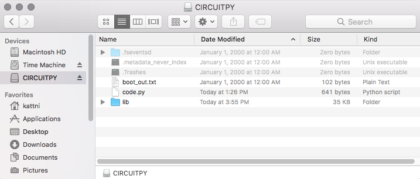
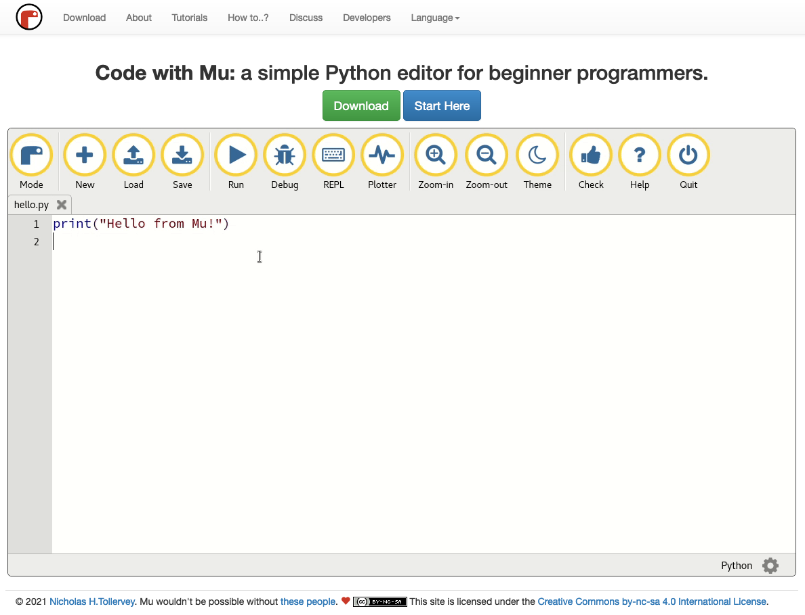

<style> .md-footer__link--next:not([hidden]) { display: none } </style>

# Programming the TinyML Development kit

The TinyML Development kit uses the [CircuitPython] programming language. It is based on the popular Python 3 programming language, and designed to simplify experimentation and learning on microcontrollers and development kits. It requires very little setup on your computer and since the language is based on Python, code is easy to read and understand. Additionally, there are many libraries available, ready to use in your project.

[CircuitPython]:https://learn.adafruit.com/welcome-to-circuitpython/what-is-circuitpython

---

The TinyML development kit is programmed using the included USB-C to USB-A cable. If your computer requires another connection (e.g. USB-C to USB-C) you have to provide your own cable for connecting the kit.

After connecting the TinyML development kit, two green LEDs on the board should light up, indicating that there is power on the board. At the same time, a new USB-drive named `CIRCUITPY` should appear on your computer (in File Explorer, Finder or Files). This drive contains code, software libraries and files. To learn more about the `CIRCUITPY`-drive, take a look at the [Adafruit - Circuitpy Drive guide](https://learn.adafruit.com/welcome-to-circuitpython/the-circuitpy-drive).

**TODO: change USB name?***



---

Programming the TinyML development kit is as easy as editing the `code.py` file that is found on the CIRCUITPY drive. However to make coding for the kit a little easier, the [Code with Mu] IDE will be used. Code with Mu works out of the box with CircuitPython, gives helpful programming prompts and was built with learning in mind.

[Code with Mu]:https://codewith.mu/

To install the software, head to the [Code with Mu - Downloads] page and install the correct version of the IDE for your computer.

[Code with Mu - Downloads]:https://codewith.mu/en/download

??? info "Advanced IDE setup"

    If you are already familiar with programming development kits, or want to work in an IDE which you are familiar with (such as Atom or VS Code), take a look at the [Adafruit - Advanced CircuitPython setup](https://learn.adafruit.com/welcome-to-circuitpython/advanced-setup).

After installing, open the Code with Mu editor and (upon first start) select the CircuitPython mode. This ensures that the IDE is set up correctly for use with the TinyML development kit.

??? info "Reset the Code with Mu editor"

    If you already started Code with Mu and did not select the CircuitPython mode, click the `Mode` button in the top left of the Code with Mu editor, and select CircuitPython. If you want more information about setting up Code with Mu for CircuitPython, take a look at the [Code with Mu - CircuitPython setup](https://codewith.mu/en/tutorials/1.2/adafruit).



---

Now you can start coding! To begin, try to make the built-in LED (D13) blink.

[]()

```python title="circuitpython_first_code.py"
# import the required libraries for accessing the pins and timing
import time
import board
from digitalio import DigitalInOut, Direction

# setup the LED
led = DigitalInOut(board.LED)
led.direction = Direction.OUTPUT

# do forever
while True:
    # turn LED on
    led.value = True
    # wait for 1 second
    time.sleep(1)
    # turn LED off
    led.value = False
    time.sleep(1)
```

Copy or write the above code into the Code with Mu editor and Save it to the TinyML development board. The red LED should start to blink.

To check out more simple code examples, take a look at the [Adafruit Learning System - Guide to CIrcuitPython](https://github.com/adafruit/Adafruit_Learning_System_Guides/tree/main/CircuitPython_Essentials) or at the sensor code examples in the [previous section](devkit.md).

---

To access I/O of the TinyML development kit, CircuitPython has defined easy references to the different pins. Certain inputs and outputs can be accessed using their semantic definition (e.g. the output connected to the red LED is `GPIO13`, however we can just reference it as `board.LED` in our code. To see all pin definitions, fold out the info box below. To learn more about the board library, visit [CircuitPython - Pins and Board](https://learn.adafruit.com/circuitpython-essentials/circuitpython-pins-and-modules).

??? info "Pin definition"

    The TinyML development kit has the following pin definitions and names:

    - `GPIO0` = `board.BUTTON1` = `board.BOOT`
    - `GPIO1` = `board.IR`
    - `GPIO2` = `board.HALL`
    - `GPIO4` = `board.I2S_CLK`
    - etc...

    The original I/O pins of the kit can also be found in the electronic schematic of the TinyML development kit, in the [previous section](devkit.md).


**TODO: update pin list with all definitions**

---

As mentioned before, it is possible to use ready-made code libraries, for example to easily integrate sensors, outputs or connectivity. Some libraries are built-in to the CircuitPython firmware, others may need to be downloaded and included in the `lib` folder on the `CIRCUITPY` drive. The examples on the TinySpark platform only use built-in libraries, however if you want to learn more about external libraries, visit the [CircuitPython - Libraries](https://learn.adafruit.com/welcome-to-circuitpython/circuitpython-libraries).

??? info "Included libraries"

    The following libraries are built-in to the default CircuitPython installation on the TinyML development kit
  
    - `analogio` (for analog I/O)
    - `array` (for generating array objects)
    - `bitbangio` (for simulating different communication protocols)
    - `board` (for getting pin numbers and descriptions)
    - `busio` (for using default data busses like I2C)
    - `collections` (for special data containers)
    - `digitalio` (for digital I/O)
    - `math` (for basic mathematic operations and constants)
    - `os` (for accessing operating level functions)
    - `pwmio` (for controlling PWM devices)
    - `random` (for generating random numbers)
    - `struct` (for defining data structures)
    - `sys` (for accessing system and program functions)
    - `time` (for timing)
    - `ulab` (for Python NumPy like maths and variables)
    - `usb_cdc` (for the USB connection)

    The following libraries are used for the sensors and outputs on the TinyML development kit.

    - `apds9930` (for the on-board Light and Distance sensor)
    - `bme280` (for the on-board Environmental sensor)
    - `ir_remote` (for the on-board IR receiver)
    - `neopixel` (for the on-board Neopixels)
    - `lsm6ds` (for the on-board Inertial motion sensor)

---

That's it! Now you know everything needed to get started with the TinySpark TinyML material.

[Go to Chapter 1](../chapter1/introduction.md){ .md-button .md-button--primary }