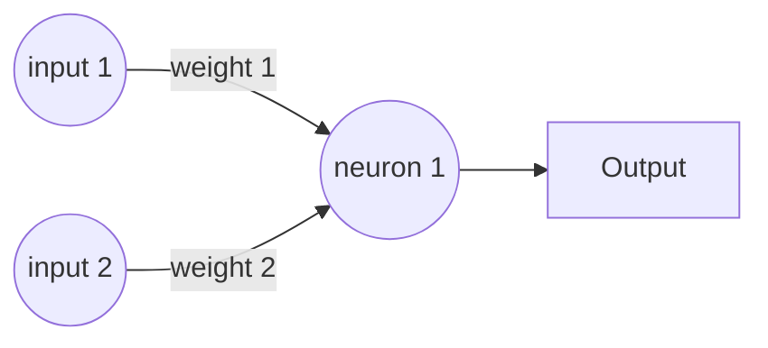

# MkDocs Material template page

Templates and Snippets for MKDocs

# Heading 1

## Heading 2

### Heading 3

This is some example text, just some words to see what's up with this documentation system, even some sp&cia/ chåräctérs @nd 0th3r ødîti€s!

The document can also contain some **bold** text, or some _italic_ text or some super^script^ or some sub~script~ or some ==highlighted== text, we can also add some keyboard keys like ++ctrl+alt+del++.

More information on text formatting can be found in the [Formatting reference].

[Formatting reference]:https://squidfunk.github.io/mkdocs-material/reference/formatting/

Additionally, block-quotes can be inserted:

> This is a blockquote containing some nonsence
>
> The blockquote can also contain multiple lines

Lists can also be generated, there are two types, Ordered Lists and Unordered lists

1. This is the first list item
2. Another item on the ordered list
    1. Nested ordered list
    2. another nested item
3. Third item in the list
    - unordered nested list
    - inside an ordered list

We need to separate lists either by text or double newlines.

- This is the first unordered item
- The second item
    - Nested unordered lists
    - Another nested item
- The third unordered item
    1. Ordered lists inside of unordered lists
    2. And another ordered item

Next, we might want to add some code to the document. Adding some `inline code` is pretty easy. Alternatively, we can also make a typeless code-block:

```
  function codeblock(String content) {
    return content.html;
  }

  String text = "This is some test content";
  codeblock(text);
```

If we want our codeblock to be styled according to a certain coding language, with line highlighting and annotations:

``` py hl_lines="3"
text = "This is some test content"

def codeBlock(content):
  html = content.html  # (1)!
  return html

codeBlock(text)
```

1.  This is the annotation that will get added to the codeblock above

Or another coding language, with title and annotations:

``` js title="codeBlock.js"
let text = "This is some test content"

function code_block(content) => {
  return content.html
}

code_block(text)
```

A 'Open in Colab' badge can be added as follows:

[](https://colab.research.google.com/drive/1ifiq6e0aOzHRPsRP8OT0_t_h8MajBrlx#scrollTo=DykfGQVnQ2k5)

More information can be found in the [Code reference].

[Code reference]: https://squidfunk.github.io/mkdocs-material/reference/code-blocks/

We can divide some content using a horizontal rule:

---

(External) content can be [linked] to websites or other [pages] of the website.

[linked]: https://google.com
[pages]: index.md

Images and ![other graphics] get added in a similar way.

[other graphics]: https://github.com/adam-p/markdown-here/raw/master/src/common/images/icon48.png "Even some tooltip information can be displayed"

If a citation is needed, footnotes[^1] and other citations can be added.

[^1]: https://google.com

Call-outs can include side stories and other less important or extra content. More info can be found in the [Admonitions reference].

[Admonitions reference]: https://squidfunk.github.io/mkdocs-material/reference/admonitions/

!!! note

    This is a admonitium or call-out with the note style, this should be displayed as such.

These call-outs can also be made collapsible:

??? info

    This is a collapsed information call-out.

We can also expand this collapsible call-out normally:

???+ warning

    This is a collapsible warning call-out that is expanded by default.

Mathematical equations can be added using the MathJax extension. More information can be found in the [MathJax reference] and the [LaTex math reference].

Formulas like $y(x)=2a*bx$ can be added inline. Alternatively, mathematical equations can be added as a code block:

$$
  f = \sum^{i=0}_{n}x_i*n_i+b^{i+1}
$$

$$
  \frac{1}{2}*\sqrt(22a+16b^5)
$$

[MathJax reference]: https://squidfunk.github.io/mkdocs-material/reference/mathjax
[LaTex math reference]: https://en.wikibooks.org/wiki/LaTeX/Mathematics

Charts can be added using the Vega-Lite plugin, more on that in the [Chart plugin reference] and the [Vega-Lite examples].

```vegalite
{
  "$schema": "https://vega.github.io/schema/vega-lite/v5.json",
  "description": "A simple bar chart with embedded data.",
  "data": {
    "values": [
      {"a": "A", "b": 28}, {"a": "B", "b": 55}, {"a": "C", "b": 43},
      {"a": "D", "b": 91}, {"a": "E", "b": 81}, {"a": "F", "b": 53},
      {"a": "G", "b": 19}, {"a": "H", "b": 87}, {"a": "I", "b": 52}
    ]
  },
  "mark": "bar",
  "encoding": {
    "x": {"field": "a", "type": "nominal", "axis": {"labelAngle": 0}},
    "y": {"field": "b", "type": "quantitative"}
  }
}
```

[Chart plugin reference]: https://github.com/timvink/mkdocs-charts-plugin
[Vega-Lite syntax reference]: https://vega.github.io/vega-lite/examples/

We can also add some diagrams using the Mermaid.js library. More info on the [Mermaid.js examples] or the [Diagram reference]



[Mermaid.js examples]: https://mermaid.js.org/syntax/examples.html
[Diagram reference]: https://squidfunk.github.io/mkdocs-material/reference/diagrams/